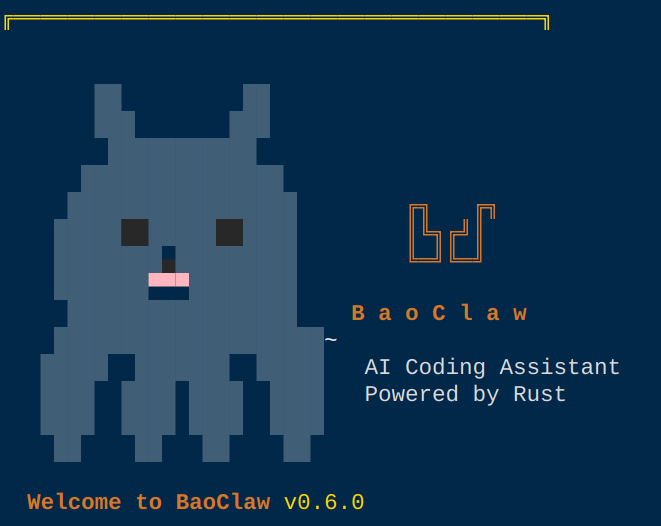

<div align="center">



# 🐾 BaoClaw

**The AI coding agent that remembers, evolves, and follows you everywhere.**

[English](#english) · [中文](#中文)

[](LICENSE)
[]()

</div>

---

<a name="english"></a>

## What is BaoClaw?

BaoClaw is an open-source AI coding agent with a Rust core engine, persistent memory, cross-device session sharing, a cron scheduler, and a self-evolution loop. It runs as a daemon on your machine and connects to your terminal, Telegram, and WhatsApp — all sharing the same conversation context.

Unlike agents that forget everything when you close the window, BaoClaw builds up knowledge about you and your projects over time. The more you use it, the better it gets.

## Key Features

### 🧠 Persistent Memory
- **Project-level memory** — each project directory gets its own `memory.jsonl`
- **Global memory** — cross-project facts, preferences, and decisions in `~/.baoclaw/`
- **Long-term recall** — memories are injected into the system prompt automatically
- **Manual control** — `/memory add`, `/memory list`, `/memory delete`

### 📱 Multi-Client, Shared Sessions
- **One daemon, many clients** — CLI, Telegram bot, and WhatsApp gateway connect to the same engine
- **Shared conversation** — start a task on your laptop terminal, continue on Telegram from your phone
- **Real-time streaming** — all clients see tool calls and responses as they happen
- **Session persistence** — conversations survive daemon restarts, tied to project directories
- **One session per project** — same directory always resumes the same conversation

### 🔄 Self-Evolution Engine
Inspired by [Hermes Agent](https://github.com/NousResearch/hermes-agent)'s learning loop:
- **Trajectory recording** — every interaction is logged with tools used, outcomes, and timing
- **Skill auto-generation** — complex successful tasks are extracted as reusable skill candidates
- **Self-evaluation nudge** — every 15 tasks, the agent reflects on patterns and creates/improves skills
- **User ratings** — rate interactions as good/bad to build preference data
- **RLHF data export** — export trajectories as JSONL for DPO/RLHF fine-tuning of smaller models
- **Personal evolution** — skills and trajectories are cross-project (`~/.baoclaw/evolution/`)
- **Evolve tool** — agent can autonomously create, improve, and promote skills

### ⏰ Cron Scheduler
- **Periodic tasks** — schedule prompts to run automatically inside the daemon
- **Flexible schedules** — `every 30m`, `every 2h`, `daily 09:00`, `weekly mon 09:00`
- **Result broadcast** — cron results pushed to all connected clients (CLI + Telegram)
- **Persistent** — jobs saved in `~/.baoclaw/cron.json`, survive daemon restarts
- **Full agent power** — each job runs with complete tool access

### 📄 Document Q&A
- **Upload files** — PDF, DOCX, and images via Telegram or CLI (`@file.pdf`)
- **Route A** — client-side text extraction (mammoth for DOCX, pdf-parse for PDF)
- **Route B** — native API document blocks (PDF sent directly to Claude/OpenAI)
- **Image understanding** — photos analyzed via multimodal API (both Anthropic and OpenAI compatible)
- **Tab completion** — `@` triggers file path completion in CLI

### 🗂️ Project-Scoped Everything
- **`/cd` command** — switch working directory at runtime, like changing projects
- **Auto-scaffold** — `.baoclaw/` directory with config files created automatically
- **Session per project** — each directory maps to its own persistent session file
- **Auto-resume** — reconnecting to a project automatically restores conversation history
- **Project instructions** — `BAOCLAW.md` loaded into system prompt per project
- **Memory isolation** — each project has its own memory store

### 🛠️ 15+ Built-in Tools
| Tool | Description |
|------|-------------|
| Bash | Shell commands (respects project cwd) |
| FileRead / FileWrite / FileEdit | File operations with path validation |
| Grep / Glob | Code search and file discovery |
| WebSearch | Brave Search API with retry on rate limits |
| WebFetch | Fetch and parse web pages |
| Memory | Long-term memory management |
| Agent | Sub-agent for parallel tasks |
| Evolve | Self-improvement: create/improve skills, export training data |
| Todo | Task list management |
| Notebook | Jupyter notebook editing |
| ProjectNote | Project-level notes |
| ToolSearch | Search across all registered tools |

### 🔌 Extensible
- **MCP support** — connect external MCP servers for additional tools
- **Skills** — markdown-based skill files loaded into system prompt (personal + project scope)
- **Plugins** — directory-based plugin system with tools, skills, and MCP configs
- **200+ LLM models** — Anthropic native + any OpenAI-compatible API (OpenRouter, Ollama, vLLM, etc.)

### 🔁 Model Fallback
- **Automatic retry** — rate-limited requests retry with exponential backoff
- **Fallback chain** — configure multiple models; if one is rate-limited, fall back to the next
- **Transparent** — CLI shows model switches in real-time

### ⌨️ Keyboard Shortcuts
- **Ctrl+C** during task → abort current task
- **Ctrl+C** when idle → hint to press again or `/quit`
- **Ctrl+C × 2** → disconnect from daemon
- **Tab** → autocomplete commands and file paths

## Architecture

```
┌─────────────┐  ┌─────────────┐  ┌─────────────┐
│  Terminal    │  │  Telegram   │  │  WhatsApp   │
│  CLI (TUI)  │  │  Bot        │  │  Gateway    │
└──────┬──────┘  └──────┬──────┘  └──────┬──────┘
       │                │                │
       └────────┬───────┴────────┬───────┘
                │   Unix Socket (IPC)    │
                │   JSON-RPC 2.0 / NDJSON│
         ┌──────┴──────────────────┐
         │   BaoClaw Daemon (Rust) │
         │                         │
         │  ┌─────────────────┐    │
         │  │  Query Engine   │    │
         │  │  (Streaming)    │    │
         │  └────────┬────────┘    │
         │           │             │
         │  ┌────────┴────────┐   │
         │  │  Tool Executor  │   │
         │  │  15+ built-in   │   │
         │  │  + MCP servers  │   │
         │  └─────────────────┘   │
         │                         │
         │  ┌─────────────────┐   │
         │  │  Cron Scheduler │   │
         │  └─────────────────┘   │
         │                         │
         │  ┌─────────────────┐   │
         │  │  Evolution      │   │
         │  │  Engine         │   │
         │  └─────────────────┘   │
         └─────────────────────────┘
                    │
         ┌──────────┴──────────┐
         │  Anthropic / OpenAI │
         │  Compatible API     │
         └─────────────────────┘
```

## Installation

### Prerequisites
- **Rust** (1.75+) — [rustup.rs](https://rustup.rs)
- **Node.js** (18+) — [nodejs.org](https://nodejs.org)
- An LLM API key (Anthropic, OpenRouter, or any OpenAI-compatible provider)

### Linux / macOS

```bash
git clone https://github.com/baohx/BaoClaw.git
cd BaoClaw
./install.sh
```

The installer builds the Rust core, installs Node.js dependencies, and creates the `baoclaw` launcher in `~/.local/bin/`.

### Windows (WSL2)

BaoClaw requires a Unix environment. On Windows, use WSL2:

```powershell
# Install WSL2 if not already installed
wsl --install

# Inside WSL2
git clone https://github.com/baohx/BaoClaw.git
cd BaoClaw
./install.sh
```

### Manual Setup

```bash
# 1. Build Rust core
cd baoclaw-core
cargo build --release
cd ..

# 2. Install CLI dependencies
cd ts-ipc
npm install
cd ..

# 3. Set your API key
export ANTHROPIC_API_KEY=sk-ant-...
# Or for OpenAI-compatible:
export ANTHROPIC_API_KEY=your-key
export ANTHROPIC_BASE_URL=https://your-provider.com/v1

# 4. Run
npx --prefix ts-ipc tsx ts-ipc/cli.ts
```

## Configuration

Global config: `~/.baoclaw/config.json`

```json
{
  "model": "claude-sonnet-4-20250514",
  "fallback_models": ["claude-3-5-haiku-20241022"],
  "max_retries_per_model": 2,
  "api_type": "anthropic",
  "openai_base_url": "https://your-proxy.com/v1",
  "telegram": {
    "token": "123456:ABC-DEF...",
    "allowedChatIds": [12345678]
  }
}
```

Project config: `<project>/.baoclaw/`
```
.baoclaw/
├── BAOCLAW.md          # Project instructions (injected into system prompt)
├── mcp.json            # MCP server configurations
├── memory.jsonl        # Project-level memories
└── skills/             # Project-specific skills
```

Global data: `~/.baoclaw/`
```
~/.baoclaw/
├── config.json         # Global configuration
├── memory.jsonl        # Global memories (fallback)
├── cron.json           # Scheduled tasks
├── sessions/           # Session transcripts (per-project)
├── skills/             # Personal skills (cross-project)
└── evolution/
    ├── trajectories.jsonl  # Interaction history for RLHF
    └── candidates/         # Auto-extracted skill candidates
```

## CLI Commands

| Command | Description |
|---------|-------------|
| `/cd <path>` | Switch project directory (auto-resume session) |
| `/tools` | List registered tools |
| `/mcp` | List MCP servers |
| `/skills` | List loaded skills |
| `/plugins` | List installed plugins |
| `/model [name]` | Show or switch model |
| `/think` | Toggle extended thinking mode |
| `/compact` | Compress conversation context |
| `/memory` | Long-term memory: list, add, delete, clear |
| `/cron` | Scheduled tasks: add, list, remove, toggle |
| `/diff` | Git diff summary |
| `/commit <msg>` | Stage all and commit |
| `/git` | Git status (branch, changes) |
| `/task` | Background tasks: run, list, status, stop |
| `/voice` | Voice input (requires whisper.cpp) |
| `/telegram` | Manage Telegram gateway: start, stop, status |
| `/telemetry` | Toggle telemetry on/off |
| `@file.pdf` | Attach file for Q&A (PDF, DOCX, images) |
| `/abort` | Cancel current request (or press Ctrl+C) |
| `/clear` | Clear screen |
| `/help` | Show all commands |
| `/quit` | Disconnect (daemon keeps running) |
| `/shutdown` | Stop the daemon process |

## Telegram Commands

All CLI commands are also available in Telegram:

| Command | Description |
|---------|-------------|
| `/tools` `/skills` `/mcp` `/plugins` | List resources |
| `/model [name]` | Show or switch model |
| `/think` | Toggle extended thinking |
| `/compact` | Compress context |
| `/memory` | Manage memories |
| `/cron` | Manage scheduled tasks |
| `/cd <path>` | Switch project directory |
| `/task` | Manage background tasks |
| `/diff` `/commit` `/git` | Git operations |
| `/abort` | Cancel current task |
| `/status` | Gateway status |
| `/help` | Show all commands |
| 📎 Upload file | Send PDF/DOCX/image for Q&A |

## Telegram Setup

1. Create a bot via [@BotFather](https://t.me/BotFather)
2. Add token to `~/.baoclaw/config.json`
3. Start from CLI: `/telegram start`

Upload documents and images directly in Telegram chat — the bot extracts text and sends it to the AI.

## Cron Examples

```
/cron add "Daily git summary" "daily 09:00" Summarize yesterday's git commits
/cron add "Dep check" "weekly mon 10:00" Check for dependency security updates
/cron add "Evolution review" "every 2h" Review pending skill candidates and improve
/cron list
/cron toggle abc123
/cron remove abc123
```

Results are pushed to all connected clients (CLI shows ⏰ notification, Telegram receives a message).

## Self-Evolution: How It Works

```
 Use BaoClaw ──→ Trajectories recorded
                        │
                        ▼
              Complex task succeeds?
                   │          │
                  Yes         No
                   │          │
                   ▼          ▼
           Extract skill    (skip)
           candidate
                   │
                   ▼
          Every 15 tasks ──→ Self-evaluation nudge
                   │
                   ▼
          Agent creates/improves skills
                   │
                   ▼
          Skills loaded in next session
                   │
                   ▼
          Better performance ──→ Loop continues
                   │
                   ▼
          Export trajectories ──→ RLHF/DPO fine-tuning
                                  for smaller models
```

### Training Data Export

```bash
# Inside BaoClaw, ask the agent:
> Export training data for fine-tuning

# Or use the Evolve tool directly:
# The agent calls Evolve(operation: "export_training")
# Output: ~/.baoclaw/evolution/training_export.jsonl
```

Each trajectory contains: prompt, tool actions, outcome, user rating (good/bad/neutral). Rated trajectories can be used as preference pairs for DPO training.

## License

MIT

---

<a name="中文"></a>

## 🐾 BaoClaw — 会记忆、会进化、跨设备的 AI 编程助手

BaoClaw 是一个开源 AI 编程 Agent，基于 Rust 核心引擎，具备持久记忆、跨设备会话共享、定时任务和自我进化能力。它以守护进程方式运行，同时连接终端、Telegram 和 WhatsApp，所有客户端共享同一个对话上下文。

和那些关掉窗口就失忆的 Agent 不同，BaoClaw 会随着使用不断积累对你和你项目的了解。用得越多，越好用。

## 核心特性

### 🧠 持久记忆
- 项目级记忆 — 每个项目目录独立的 `memory.jsonl`
- 全局记忆 — 跨项目的个人偏好和决策
- 自动注入 — 记忆自动加载到系统提示词中
- 手动管理 — `/memory add`、`/memory list`、`/memory delete`

### 📱 多客户端共享会话
- 一个守护进程，多个客户端 — 终端、Telegram、WhatsApp 连接同一个引擎
- 共享对话 — 在电脑终端开始任务，用手机 Telegram 继续
- 实时流式输出 — 所有客户端同步看到工具调用和响应
- 会话持久化 — 对话在守护进程重启后自动恢复，按项目目录绑定
- 一个项目一个会话 — 同一目录始终恢复同一个对话

### 🔄 自我进化引擎
参考 [Hermes Agent](https://github.com/NousResearch/hermes-agent) 的学习循环：
- 轨迹记录 — 每次交互自动记录工具调用、结果和耗时
- Skill 自动生成 — 复杂的成功任务自动提取为可复用的 skill 候选
- 自我评估 — 每 15 个任务触发反思，创建或改进 skill
- 用户评价 — 对交互评分（good/bad），构建偏好数据
- RLHF 数据导出 — 导出轨迹数据用于小模型的 DPO/RLHF 微调
- 个人级进化 — skill 和轨迹跨项目积累（`~/.baoclaw/evolution/`）
- Evolve 工具 — Agent 可自主创建、改进和提升 skill

### ⏰ 定时任务
- 周期执行 — 在守护进程内自动运行预设的提示词
- 灵活调度 — `every 30m`、`every 2h`、`daily 09:00`、`weekly mon 09:00`
- 结果推送 — 定时任务结果推送到所有连接的客户端（终端 + Telegram）
- 持久化 — 任务保存在 `~/.baoclaw/cron.json`，守护进程重启后自动恢复
- 完整能力 — 每个任务都拥有完整的 Agent 工具访问权限

### 📄 文档问答
- 上传文件 — 通过 Telegram 或终端（`@file.pdf`）上传 PDF、DOCX、图片
- 文本提取 — DOCX 用 mammoth，PDF 用 pdf-parse
- 原生文档 — PDF 可直接发送给 Claude API
- 图片理解 — 支持 Anthropic 和 OpenAI 兼容 API 的多模态
- Tab 补全 — 终端中输入 `@` 后按 Tab 自动补全文件路径

### 🗂️ 项目级隔离
- `/cd` 命令 — 运行时切换工作目录，相当于切换项目
- 自动初始化 — 新目录自动创建 `.baoclaw/` 配置骨架
- 项目绑定会话 — 每个目录对应独立的持久化会话文件
- 自动恢复 — 重连时自动恢复项目的对话历史
- 项目指令 — `BAOCLAW.md` 按项目加载到系统提示词
- 记忆隔离 — 每个项目有独立的记忆存储

### 🛠️ 15+ 内置工具
Bash、文件读写编辑、Grep、Glob、Web 搜索、Web 抓取、记忆管理、子 Agent、自我进化、Todo、Notebook 编辑、项目笔记、工具搜索等。

### 🔌 可扩展
- MCP 协议 — 连接外部 MCP 服务器获取更多工具
- Skills — Markdown 格式的技能文件（个人级 + 项目级）
- 插件系统 — 目录式插件，包含工具、技能和 MCP 配置
- 200+ 模型 — Anthropic 原生 + 任意 OpenAI 兼容 API

### 🔁 模型降级
- 自动重试 — 限流时指数退避重试
- 降级链 — 配置多个模型，限流时自动切换
- 透明提示 — 终端实时显示模型切换

### ⌨️ 快捷键
- `Ctrl+C`（任务中）→ 中止当前任务
- `Ctrl+C`（空闲时）→ 提示再按一次退出
- `Ctrl+C × 2` → 断开连接
- `Tab` → 自动补全命令和文件路径

## 安装

### 前置条件
- Rust (1.75+) — [rustup.rs](https://rustup.rs)
- Node.js (18+) — [nodejs.org](https://nodejs.org)
- LLM API Key（Anthropic、OpenRouter 或任意 OpenAI 兼容服务）

### Linux / macOS

```bash
git clone https://github.com/baohx/BaoClaw.git
cd BaoClaw
./install.sh
```

### Windows (WSL2)

```powershell
wsl --install
# 在 WSL2 中
git clone https://github.com/baohx/BaoClaw.git
cd BaoClaw
./install.sh
```

### 使用

```bash
export ANTHROPIC_API_KEY=sk-ant-...
baoclaw
```

OpenAI 兼容模式：
```bash
export ANTHROPIC_API_KEY=your-key
export ANTHROPIC_BASE_URL=https://your-provider.com/v1
baoclaw
```

## 完整命令列表

| 命令 | 说明 |
|------|------|
| `/cd <路径>` | 切换项目目录（自动恢复会话） |
| `/tools` | 列出已注册的工具 |
| `/mcp` | 列出 MCP 服务器 |
| `/skills` | 列出已加载的技能 |
| `/plugins` | 列出已安装的插件 |
| `/model [名称]` | 查看或切换模型 |
| `/think` | 切换扩展思考模式 |
| `/compact` | 压缩对话上下文 |
| `/memory` | 长期记忆：list, add, delete, clear |
| `/cron` | 定时任务：add, list, remove, toggle |
| `/diff` | 查看 git diff |
| `/commit <消息>` | 暂存并提交 |
| `/git` | 查看 git 状态 |
| `/task` | 后台任务：run, list, status, stop |
| `/voice` | 语音输入（需要 whisper.cpp） |
| `/telegram` | 管理 Telegram 网关 |
| `/telemetry` | 切换遥测 |
| `@file.pdf` | 附加文件进行问答 |
| `/abort` | 取消当前请求（或按 Ctrl+C） |
| `/clear` | 清屏 |
| `/help` | 显示所有命令 |
| `/quit` | 断开连接（守护进程保持运行） |
| `/shutdown` | 停止守护进程 |

## 定时任务示例

```
/cron add "每日git总结" "daily 09:00" 总结昨天的git提交
/cron add "依赖检查" "weekly mon 10:00" 检查项目依赖安全更新
/cron add "进化评估" "every 2h" 检查待处理的skill候选并改进
/cron list
/cron toggle abc123
/cron remove abc123
```

## 自我进化：工作原理

```
使用 BaoClaw ──→ 记录交互轨迹
                      │
                      ▼
              复杂任务成功完成？
                 │          │
                是           否
                 │          │
                 ▼          ▼
          提取 skill      (跳过)
          候选
                 │
                 ▼
        每 15 个任务 ──→ 触发自我评估
                 │
                 ▼
        Agent 创建/改进 skill
                 │
                 ▼
        下次会话加载新 skill
                 │
                 ▼
        表现更好 ──→ 循环继续
                 │
                 ▼
        导出轨迹数据 ──→ RLHF/DPO 微调小模型
```

## 许可证

MIT
