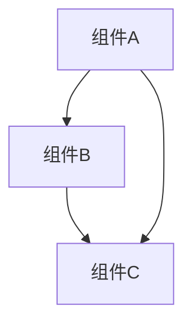
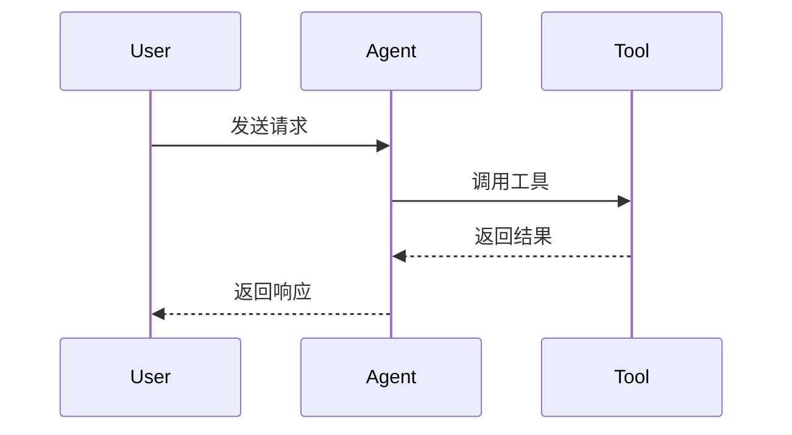

# 章节标题

<!-- 
  这是 book2 章节的模板文件。
  每个章节必须包含以下四个部分：问题、模式、实现、思考。
  请按照此模板结构撰写章节内容。
  
  Requirements: 5.1-5.5
-->

## 元数据

<!-- 可选的前置信息 -->

- **难度**: beginner | intermediate | advanced
- **预计阅读时间**: XX 分钟
- **前置章节**: chapter-id-1, chapter-id-2
- **相关代码**: baoclaw-core/src/xxx/

---

## 问题

<!-- 
  Requirements: 5.1
  描述该章节解决的实际工程问题。
  说明为什么需要这个技术/设计/模式。
-->

在这一部分，我们需要解决以下问题：

1. **问题一描述**: 详细说明问题的背景和影响
2. **问题二描述**: 说明现有方案的局限性
3. **问题三描述**: 引出本章要介绍的技术方案

### 问题背景

<!-- 提供必要的上下文信息 -->

### 现状分析

<!-- 分析当前解决方案的不足 -->

---

## 模式

<!-- 
  Requirements: 5.2
  讲解通用的设计模式或架构范式。
  使用架构图辅助说明。
-->

### 核心概念

<!-- 解释关键概念和术语 -->

### 设计原则

<!-- 说明设计背后的原则 -->

### 架构图

<!-- 
  使用 Mermaid 语法绘制架构图
  支持: graph, sequenceDiagram, classDiagram, flowchart 等
-->



### 工作流程



---

## 实现

<!-- 
  Requirements: 5.3
  提供 BaoClaw 的 Rust 代码示例。
  标注源文件路径以便读者查找完整实现。
-->

### 示例 1: 核心实现

<!-- 
  代码块元数据语法:
  ```language path="相对路径" lines="起始行-结束行"
  
  - path: BaoClaw 源文件相对路径（从项目根目录开始）
  - lines: 可选，指定代码行范围
-->

```rust path="baoclaw-core/src/engine/query_engine.rs" lines="1-50"
// 核心实现代码示例
// 请替换为实际的 BaoClaw 代码

/// 这是核心函数的文档注释
/// 解释函数的用途和行为
pub async fn core_function(
    &mut self,
    input: String,
) -> Result<Output> {
    // 实现细节
    let processed = self.preprocess(input)?;
    let result = self.execute(processed).await?;
    Ok(result)
}
```

**代码说明:**

- 第 1-10 行: 导入和类型定义
- 第 11-20 行: 核心逻辑
- 第 21-30 行: 错误处理

### 示例 2: 辅助功能

```rust path="baoclaw-core/src/tools/executor.rs" lines="100-150"
/// 工具执行器
pub struct ToolExecutor {
    registry: ToolRegistry,
    timeout: Duration,
}

impl ToolExecutor {
    /// 执行工具调用
    pub async fn execute(&self, call: ToolCall) -> Result<ToolResult> {
        let tool = self.registry.get(&call.name)?;
        let result = tokio::time::timeout(
            self.timeout,
            tool.execute(call.args),
        ).await??;
        Ok(result)
    }
}
```

### TypeScript 客户端示例

<!-- 当涉及 TypeScript 客户端实现时，明确标注 -->

```typescript path="ts-ipc/cli.ts" lines="50-80"
// TypeScript 客户端实现示例

interface ToolCall {
  name: string;
  args: Record<string, unknown>;
}

async function executeTool(call: ToolCall): Promise<ToolResult> {
  const response = await fetch('/api/tool', {
    method: 'POST',
    body: JSON.stringify(call),
  });
  return response.json();
}
```

### 常见错误示例

<!-- Requirements: 3.4 展示常见实现错误及修正方法 -->

#### 错误示例 1: 缺少超时控制

```rust
// ❌ 错误：可能导致无限阻塞
async fn execute(&self, tool: ToolCall) -> Result<ToolResult> {
    self.run_tool(tool).await // 可能永远阻塞
}
```

**修正方法:**

```rust
// ✅ 正确：添加超时控制
async fn execute(&self, tool: ToolCall) -> Result<ToolResult> {
    tokio::time::timeout(
        self.config.tool_timeout,
        self.run_tool(tool),
    ).await?
}
```

#### 错误示例 2: 错误处理不当

```rust
// ❌ 错误：吞掉错误信息
async fn process(&self, input: String) -> String {
    match self.handle(input).await {
        Ok(result) => result,
        Err(_) => "error".to_string(), // 丢失错误信息
    }
}
```

**修正方法:**

```rust
// ✅ 正确：保留错误上下文
async fn process(&self, input: String) -> Result<String> {
    self.handle(input).await
        .map_err(|e| Error::ProcessFailed {
            input: input.clone(),
            source: e,
        })
}
```

---

## 思考

<!-- 
  Requirements: 5.4
  讨论替代方案与权衡决策。
-->

### 替代方案

<!-- 列出其他可能的实现方案及其优劣 -->

#### 方案 A: [方案名称]

- **优点:**
  - 优点 1
  - 优点 2
- **缺点:**
  - 缺点 1
  - 缺点 2
- **适用场景:** 说明何时应该选择此方案

#### 方案 B: [方案名称]

- **优点:**
  - 优点 1
- **缺点:**
  - 缺点 1
- **适用场景:** 说明何时应该选择此方案

### 权衡决策

<!-- 用表格形式展示设计决策及其影响 -->

| 决策点 | 选择 | 原因 | 影响 |
|--------|------|------|------|
| 异步运行时 | Tokio | 生态成熟 | 高性能异步 |
| 错误处理 | anyhow | 简洁易用 | 灵活的错误类型 |
| 序列化 | serde | Rust 标准 | 广泛兼容性 |
| 日志框架 | tracing | 结构化日志 | 便于调试和监控 |

### 设计决策记录

<!-- 记录重要的设计决策及其理由 -->

#### 决策 1: 为什么选择 X 而不是 Y？

**背景:** 问题描述

**选项:**
1. 方案 X: 描述
2. 方案 Y: 描述

**决定:** 选择方案 X

**理由:** 详细说明选择的原因

---

## 总结

<!-- 
  Requirements: 5.5
  提供要点总结与延伸阅读链接。
-->

### 核心要点

- 要点 1: 简洁描述本章最重要的概念
- 要点 2: 关键的实现技巧
- 要点 3: 需要注意的陷阱
- 要点 4: 最佳实践建议

### 关键概念回顾

1. **概念 1**: 简短定义和解释
2. **概念 2**: 简短定义和解释
3. **概念 3**: 简短定义和解释

### 延伸阅读

<!-- Requirements: 3.5 提供 BaoClaw GitHub 仓库链接 -->

#### 官方资源

- [BaoClaw GitHub 仓库](https://github.com/baoclaw/baoclaw) - 完整源码实现
- [BaoClaw 文档](https://docs.baoclaw.dev) - 官方文档

#### 相关章节

- [上一章节](./../prev-chapter/) - 前置知识
- [下一章节](./../next-chapter/) - 进阶内容

#### 外部资源

- [Rust 官方文档](https://doc.rust-lang.org/) - Rust 语言参考
- [Tokio 文档](https://tokio.rs/) - 异步运行时文档
- [相关技术文章](https://example.com/article) - 深入阅读

---

## 附录

<!-- 可选的补充材料 -->

### 术语表

| 术语 | 定义 |
|------|------|
| Term 1 | 定义说明 |
| Term 2 | 定义说明 |

### API 参考

<!-- 相关 API 的快速参考 -->

```rust
// 关键 API 签名
pub fn important_function(arg1: Type1, arg2: Type2) -> Result<Output>;
```

---

<!-- 
  模板使用说明:
  
  1. 复制此模板到新章节目录，重命名为 README.md
  2. 替换所有占位符内容
  3. 确保所有代码块都有正确的 path 标注
  4. 删除此注释部分
  5. 运行验证器检查章节结构完整性
  
  代码块路径标注格式:
  - Rust: path="baoclaw-core/src/xxx.rs" lines="start-end"
  - TypeScript: path="ts-ipc/xxx.ts" lines="start-end"
  - 配置文件: path="config/xxx.toml"
  
  验证命令:
  npm run validate-chapter -- chapters/xx-chapter-name/
-->
