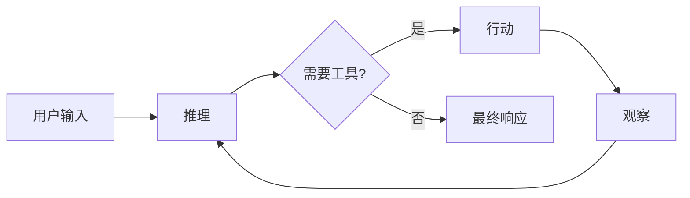
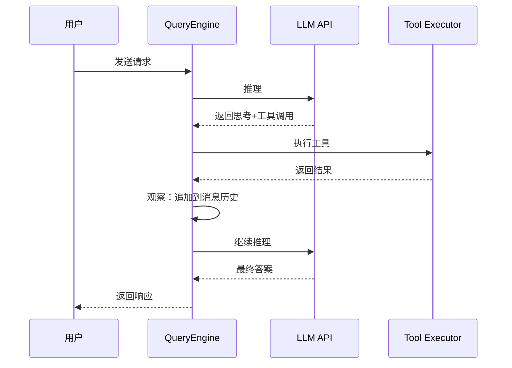

# Agent 基础

<!--
  第一章：基础部分
  本章介绍 Agent 的基础概念和核心原理。
  
  Requirements: 5.1-5.5, 1.1
-->

## 元数据

- **难度**: beginner
- **预计阅读时间**: 20 分钟
- **前置章节**: 无
- **相关代码**: baoclaw-core/src/engine/, baoclaw-core/src/tools/

---

## 问题

<!-- Requirements: 5.1 描述该章节解决的实际工程问题 -->

在构建 AI 应用时，我们面临以下核心问题：

### 1. LLM 只能生成文本，无法执行操作

大语言模型（LLM）本质上是一个函数：输入文本，输出文本。它没有记忆、没有工具、没有自主行动的能力。

```
LLM: text → text
```

当你问它"帮我创建一个文件"，它只能告诉你怎么做，但不能真的去做。

### 2. 缺乏持续的状态管理

传统聊天机器人是一次性的输入输出，无法记住之前发生了什么。长时间的对话需要：
- 保持对话历史
- 理解项目上下文
- 记住用户偏好

### 3. 难以集成外部系统

要让 AI 执行实际操作（读写文件、调用 API、运行命令），需要一套统一的接口来：
- 注册和管理工具
- 处理权限控制
- 处理执行结果

### 问题背景

Agent 作为 LLM 的扩展，通过**工具系统**获得与外部世界交互的能力，通过**记忆系统**保持状态，通过**ReAct 循环**持续决策。

```
Agent: 指令 → [思考 → 行动 → 观察]* → 结果
```

---

## 模式

<!-- Requirements: 5.2 讲解通用的设计模式或架构范式 -->

### 核心设计模式：ReAct 循环

Agent 的核心设计模式是 **ReAct 循环**（Reasoning-Action-Observation）。

#### 三个阶段

| 阶段 | 英文 | 作用 | BaoClaw 实现 |
|------|------|------|-------------|
| 推理 | Reasoning | 分析当前状态，决定下一步行动 | LLM API 调用 |
| 行动 | Action | 执行具体的工具调用 | Tool Executor |
| 观察 | Observation | 获取执行结果并更新状态 | Message 追加 |

#### 架构图



#### 工作流程



### Agent Harness 架构

Agent Harness（Agent 运行时框架）是承载 Agent 运行的基础设施：

```
┌─────────────────────────────────────────────────┐
│                   Clients                        │
│  ┌──────────┐  ┌──────────────┐  ┌───────────┐ │
│  │ Terminal  │  │   Telegram   │  │ Feishu    │ │
│  │  CLI      │  │   Gateway    │  │ Gateway   │ │
│  └─────┬────┘  └──────┬───────┘  └─────┬─────┘ │
│        └───────────────┼───────────────┘        │
│                        │ IPC (JSON-RPC / UDS)   │
│                        ▼                        │
│  ┌─────────────────────────────────────────────┐│
│  │              Daemon (Rust)                   ││
│  │  ┌─────────────────────────────────────┐    ││
│  │  │         QueryEngine                  │    ││
│  │  │  Messages ←→ LLM API ←→ Tools       │    ││
│  │  └─────────────────────────────────────┘    ││
│  └─────────────────────────────────────────────┘│
└─────────────────────────────────────────────────┘
```

---

## 实现

<!-- Requirements: 5.3 提供 BaoClaw 的 Rust 代码示例 -->

### 示例 1: QueryEngine 核心结构

QueryEngine 是 BaoClaw 的核心组件，负责调用 LLM API、管理消息历史和执行工具。

```rust path="baoclaw-core/src/engine/query_engine.rs" lines="32-64"
/// Configuration for the QueryEngine.
pub struct QueryEngineConfig {
    pub cwd: PathBuf,
    pub tools: Vec<Arc<dyn Tool>>,
    pub api_client: Arc<UnifiedClient>,
    pub model: String,
    pub thinking_config: ThinkingConfig,
    pub max_turns: Option<u32>,
    pub max_budget_usd: Option<f64>,
    pub verbose: bool,
    pub custom_system_prompt: Option<String>,
    pub append_system_prompt: Option<String>,
    pub session_id: Option<String>,
    pub fallback_models: Vec<String>,
    pub max_retries_per_model: u32,
    /// Model context window (tokens). Default: 200_000 (Claude).
    pub context_window: u64,
    /// Auto-compact threshold as fraction of `context_window`. Default: 0.7.
    pub auto_compact_threshold_ratio: f64,
    // ... 其他字段
}
```

**代码说明:**

- `tools: Vec<Arc<dyn Tool>>` - 注册的工具列表，实现 Tool trait
- `max_turns` - 最大迭代次数，防止无限循环
- `context_window` - 上下文窗口大小，用于 token 计数和自动压缩
- `thinking_config` - 思考模式配置（enabled/disabled/adaptive）

### 示例 2: EngineEvent 事件类型

EngineEvent 定义了 Agent 循环中产生的各种事件：

```rust path="baoclaw-core/src/engine/query_engine.rs" lines="77-130"
/// Events yielded by the QueryEngine during message processing.
#[derive(Clone, Debug, Serialize, Deserialize)]
#[serde(tag = "type")]
pub enum EngineEvent {
    #[serde(rename = "assistant_chunk")]
    AssistantChunk {
        content: String,
        #[serde(skip_serializing_if = "Option::is_none")]
        tool_use_id: Option<String>,
    },
    #[serde(rename = "thinking_chunk")]
    ThinkingChunk {
        content: String,
    },
    #[serde(rename = "tool_use")]
    ToolUse {
        tool_name: String,
        input: Value,
        tool_use_id: String,
    },
    #[serde(rename = "tool_result")]
    ToolResult {
        tool_use_id: String,
        output: Value,
        is_error: bool,
    },
    // ... 其他事件类型
}
```

**事件流示例:**

```
1. TurnStart { turn_id: 1 }
2. AssistantChunk { content: "让我先读取文件..." }
3. ToolUse { tool_name: "FileRead", input: {...}, tool_use_id: "xxx" }
4. ToolResult { tool_use_id: "xxx", output: "文件内容", is_error: false }
5. AssistantChunk { content: "现在我来修改..." }
6. TurnEnd { turn_id: 1, tool_count: 1 }
```

### 示例 3: Tool Trait 定义

Tool trait 是所有工具必须实现的接口：

```rust path="baoclaw-core/src/tools/trait_def.rs" lines="62-100"
/// The core Tool trait that all tools must implement
#[async_trait]
pub trait Tool: Send + Sync {
    /// The unique name of this tool
    fn name(&self) -> &str;

    /// Alternative names for this tool
    fn aliases(&self) -> Vec<&str> {
        vec![]
    }

    /// JSON Schema for the tool's input
    fn input_schema(&self) -> JsonSchema;

    /// Whether this tool only reads data (doesn't modify filesystem)
    fn is_read_only(&self, _input: &Value) -> bool {
        false
    }

    /// Whether this tool is destructive (e.g., deletes files)
    fn is_destructive(&self, _input: &Value) -> bool {
        false
    }

    /// Whether this tool can be safely executed concurrently with other tools
    fn is_concurrency_safe(&self, _input: &Value) -> bool {
        false
    }

    /// Execute the tool with the given input
    async fn call(
        &self,
        input: Value,
        context: &ToolContext,
        progress: &dyn ProgressSender,
    ) -> Result<ToolResult, ToolError>;

    /// Get the system prompt contribution for this tool
    fn prompt(&self) -> String;
}
```

**关键方法说明:**

| 方法 | 作用 | 示例 |
|------|------|------|
| `name()` | 返回工具名称 | `"FileRead"` |
| `input_schema()` | 返回输入 JSON Schema | `{"type": "object", "properties": {...}}` |
| `is_read_only()` | 是否只读工具 | `FileRead` → true, `FileWrite` → false |
| `is_concurrency_safe()` | 是否可并发执行 | `Glob` → true, `FileWrite` → false |
| `call()` | 执行工具 | 读取文件、运行命令等 |

### 示例 4: 工具执行流程

工具执行器处理验证、权限检查和调用：

```rust path="baoclaw-core/src/tools/executor.rs" lines="45-78"
/// Execute a single tool following the pipeline: validate → permissions → call
pub async fn execute_tool(
    tool: &dyn Tool,
    request: &ToolUseRequest,
    context: &ToolContext,
    progress: &dyn ProgressSender,
) -> ToolExecutionResult {
    let tool_name = tool.name().to_string();
    let tool_use_id = request.id.clone();

    // Step 1: Validate input
    let validation = tool.validate_input(&request.input, context).await;
    if let ValidationResult::Invalid { message, .. } = validation {
        return ToolExecutionResult {
            tool_use_id,
            tool_name,
            output: Value::String(format!("Validation error: {}", message)),
            is_error: true,
        };
    }

    // Step 2: Check permissions
    let permission = tool.check_permissions(&request.input, context).await;
    if let ToolPermissionCheckResult::Deny { message } = permission {
        return ToolExecutionResult {
            tool_use_id,
            tool_name,
            output: Value::String(format!("Permission denied: {}", message)),
            is_error: true,
        };
    }

    // Step 3: Call the tool with abort awareness
    let call_result = tool.call(request.input.clone(), context, progress).await;
    // ... 处理结果
}
```

### 示例 5: 消息提交与循环入口

用户消息提交后进入 ReAct 循环：

```rust path="baoclaw-core/src/engine/query_engine.rs" lines="660-730"
    /// Submit a user message and process the response loop.
    /// Returns a receiver that yields EngineEvent items.
    pub async fn submit_message(
        &mut self,
        prompt: String,
    ) -> mpsc::Receiver<EngineEvent> {
        self.submit_message_with_attachments(prompt, None).await
    }

    pub async fn submit_message_with_attachments(
        &mut self,
        prompt: String,
        attachments: Option<Vec<serde_json::Value>>,
    ) -> mpsc::Receiver<EngineEvent> {
        // Reset abort flag for the new query
        let _ = self.abort_tx.send(false);

        let (tx, rx) = mpsc::channel(256);

        // Build user message content
        let content = if let Some(att) = attachments {
            // ... 处理多模态内容
        } else {
            Value::String(prompt)
        };

        // Build the user message and append to history
        let user_msg = Message {
            uuid: uuid::Uuid::new_v4().to_string(),
            timestamp: chrono::Utc::now().to_rfc3339(),
            content: MessageContent::User {
                message: ApiUserMessage {
                    role: "user".to_string(),
                    content,
                },
                is_meta: false,
                tool_use_result: None,
            },
        };
        self.messages.push(user_msg);

        // ... Token budget check, auto-compact, spawn query loop
        // ...
    }
```

### 示例 6: ReAct 循环核心实现

`run_query_loop` 是 ReAct 循环的真正实现，展示了"推理-行动-观察"的迭代过程：

```rust path="baoclaw-core/src/engine/query_engine.rs" lines="950-1050"
/// The core query loop that calls the LLM, processes tool uses, and loops until done.
async fn run_query_loop(
    messages: &mut Vec<Message>,
    mut config: QueryLoopConfig,
    tx: mpsc::Sender<EngineEvent>,
) {
    let start_time = std::time::Instant::now();
    let mut turn_count = 0u32;
    let mut total_usage = EMPTY_USAGE;

    loop {
        // 发送 TurnStart 事件
        turn_id_counter += 1;
        let _ = tx.send(EngineEvent::TurnStart {
            turn_id: turn_id_counter,
            parent_turn_id: config.parent_turn_id,
            agent_label: config.agent_label.clone(),
        }).await;

        // === 推理阶段 ===
        // 调用 LLM API，获取思考内容和工具调用请求
        let request = build_api_request(&messages, &config);
        let mut stream = config.api_client.create_message_stream(request).await;

        // 处理 SSE 流事件，累积 content blocks
        let mut assistant_content_blocks: Vec<ContentBlock> = Vec::new();
        // ... 流式处理 LLM 响应

        // === 行动阶段 ===
        // 检查是否有工具调用
        let tool_uses = extract_tool_uses(&assistant_content_blocks);

        if tool_uses.is_empty() {
            // 没有工具调用 → 查询完成
            let _ = tx.send(EngineEvent::Result(QueryResult {
                status: QueryStatus::Complete,
                text: extract_text(&assistant_content_blocks),
                // ...
            })).await;
            return;
        }

        // 执行工具
        let tool_context = ToolContext {
            cwd: config.cwd.clone(),
            model: config.model.clone(),
            abort_signal: Arc::new(config.abort_rx.clone()),
            // ...
        };
        let tool_results = execute_tools(&config.tools, &tool_uses, &tool_context, &progress).await;

        // === 观察阶段 ===
        // 将工具结果追加到消息历史
        let tool_result_msg = build_tool_result_message(&tool_results);
        messages.push(tool_result_msg);

        // 发送 TurnEnd 事件，继续下一轮循环
        turn_count += 1;
    }
}
```

**ReAct 循环的工作流程：**

1. **推理 (Reasoning)**: 调用 LLM API，分析当前状态，产生思考内容和工具调用请求
2. **行动 (Action)**: 如果有工具调用，执行工具（验证 → 权限检查 → 调用）
3. **观察 (Observation)**: 将工具执行结果追加到消息历史，作为下一轮的输入
4. **循环**: 如果 LLM 返回了工具调用，则回到步骤 1 继续推理；否则返回最终结果

### 常见错误示例

#### 错误示例 1：缺少超时控制

```rust
// ❌ 错误：可能导致无限阻塞
async fn execute(&self, tool: ToolCall) -> Result<ToolResult> {
    self.run_tool(tool).await // 可能永远阻塞
}
```

**修正方法：**

```rust
// ✅ 正确：添加超时控制
async fn execute(&self, tool: ToolCall) -> Result<ToolResult> {
    tokio::time::timeout(
        self.config.tool_timeout,
        self.run_tool(tool),
    ).await?
}
```

#### 错误示例 2：忘记处理 abort 信号

```rust
// ❌ 错误：长时间运行的工具无法被中断
async fn call(&self, input: Value, ctx: &ToolContext) -> Result<ToolResult> {
    // 执行耗时操作...
    let result = self.long_running_task().await;
    Ok(result)
}
```

**修正方法：**

```rust
// ✅ 正确：检查 abort 信号
async fn call(&self, input: Value, ctx: &ToolContext) -> Result<ToolResult> {
    tokio::select! {
        result = self.long_running_task() => Ok(result),
        _ = await_abort(ctx.abort_signal.clone()) => {
            Err(ToolError::Aborted)
        }
    }
}
```

---

## 思考

<!-- Requirements: 5.4 讨论替代方案与权衡决策 -->

### 替代方案

#### 方案 A: 同步执行模型

- **优点:** 实现简单，易于理解和调试
- **缺点:** 效率低，无法处理并发请求，阻塞主线程
- **适用场景:** 单用户、低并发场景

#### 方案 B: 多线程模型

- **优点:** 性能好，真正的并行执行
- **缺点:** 实现复杂，需要处理线程安全问题，Rust 的 async 更轻量
- **适用场景:** CPU 密集型任务

#### 方案 C: 异步模型（Tokio）✓

- **优点:** 高并发、资源高效、Rust 生态主流
- **缺点:** 需要理解异步编程模型
- **适用场景:** I/O 密集型、高并发场景（BaoClaw 选择）

### 权衡决策

| 决策点 | 选择 | 原因 | 影响 |
|--------|------|------|------|
| 异步模型 | Tokio | Rust 异步标准，生态成熟 | 高并发支持 |
| 错误处理 | Result 类型 | 类型安全，强制处理错误 | 代码健壮性 |
| 状态管理 | 内存 + 持久化 | 平衡性能和可靠性 | 支持恢复 |
| 事件传递 | mpsc channel | 解耦组件，支持流式 | 实时响应 |
| 工具接口 | Trait 对象 | 动态分发，插件化 | 扩展性 |

### 设计决策：为什么用 Trait 对象？

```rust
tools: Vec<Arc<dyn Tool>>
```

**优点:**
- 动态分发：运行时决定调用哪个工具
- 插件化：可以动态注册新工具（如 MCP 工具）
- 统一接口：所有工具共享相同的调用方式

**缺点:**
- 轻微性能开销（虚表查找）
- 无法内联优化

**结论:** 对于 Agent 场景，工具调用的网络延迟远大于虚表开销，动态分发的灵活性更重要。

---

## 总结

<!-- Requirements: 5.5 提供要点总结与延伸阅读链接 -->

### 核心要点

- **Agent 是 LLM 的扩展**：具有推理、行动、记忆三个核心能力
- **ReAct 循环**：推理-行动-观察的迭代过程，是 Agent 的核心决策模式
- **QueryEngine**：BaoClaw 的核心组件，负责调用 LLM API、管理消息、执行工具
- **Tool Trait**：统一的工具接口，支持验证、权限检查、并发控制
- **异步架构**：Tokio 是 Rust 高并发 Agent 的首选

### 关键概念回顾

1. **Agent Harness**：承载 Agent 运行的基础设施，包括进程管理、IPC、工具注册等
2. **ReAct 循环**：`思考 → 行动 → 观察` 的迭代决策模式
3. **Tool System**：为 Agent 提供执行能力的组件，通过 `Tool trait` 定义统一接口
4. **EngineEvent**：Agent 循环中产生的事件，用于流式输出和状态同步

### 延伸阅读

#### 官方资源

- [BaoClaw GitHub](https://github.com/baoclaw/baoclaw) - 完整源码实现
- [QueryEngine 源码](./../../../baoclaw-core/src/engine/query_engine.rs) - 核心引擎实现
- [Tool Trait 源码](./../../../baoclaw-core/src/tools/trait_def.rs) - 工具接口定义

#### 相关章节

- [下一章：工具系统详解](./../02-core-implementation/) - 深入理解 Tool trait 和工具执行
- [记忆与上下文](./../03-memory-context/) - 了解消息管理和上下文压缩

#### 外部资源

- [Rust 异步编程](https://rust-lang.github.io/async-book/) - 异步编程指南
- [Tokio 文档](https://tokio.rs/) - 异步运行时参考
- [ReAct 论文](https://arxiv.org/abs/2210.03629) - ReAct 模式原始论文
