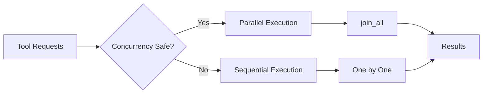

# 工具系统与扩展

<!--
  第二章：核心实现
  本章讲解工具系统、MCP 协议和 Skills/Plugins 机制。
  
  Requirements: 1.2, 3.1, 9.3
-->

## 元数据

- **难度**: intermediate
- **预计阅读时间**: 30 分钟
- **前置章节**: [Agent 基础](./../01-fundamentals/)
- **相关代码**: baoclaw-core/src/tools/, baoclaw-core/src/mcp/, baoclaw-core/src/discovery/

---

## 问题

<!-- Requirements: 5.1 描述该章节解决的实际工程问题 -->

在构建 Agent 时，我们面临以下核心问题：

### 1. 如何让 Agent 获得执行能力？

LLM 只能生成文本，无法直接操作文件系统、执行命令或调用外部 API。需要一套机制让 Agent 能够：

- 读取和写入文件
- 执行 Shell 命令
- 搜索代码库
- 访问网络资源

### 2. 如何支持动态扩展？

内置工具无法覆盖所有场景。用户可能需要：

- 集成特定的 API 服务
- 添加自定义的分析工具
- 连接企业内部系统

### 3. 如何保证执行安全？

工具执行涉及敏感操作：

- 文件修改可能破坏代码
- Shell 命令可能有危险副作用
- 网络请求可能泄露数据

### 4. 如何处理大规模结果？

工具执行可能产生大量输出：

- 文件读取可能返回超大内容
- 搜索结果可能有数千条
- 大型 base64 编码的图像数据

### 问题背景

工具系统是 Agent 与外部世界交互的桥梁。一个设计良好的工具系统需要平衡**灵活性**（支持各种工具类型）、**安全性**（权限控制、危险操作防护）和**性能**（并发执行、结果处理）。

---

## 模式

<!-- Requirements: 5.2 讲解通用的设计模式或架构范式 -->

### 核心设计模式：Trait-based Plugin Architecture

BaoClaw 的工具系统采用 **Trait-based Plugin Architecture**，核心是 `Tool` trait，所有工具（内置工具和 MCP 工具）都实现该 trait。

#### 架构图

```
┌─────────────────────────────────────────────────────────────┐
│                      Tool System                             │
│  ┌─────────────────┐                                        │
│  │   Tool Trait    │  ← 核心抽象 (trait_def.rs)             │
│  │  - name()       │                                        │
│  │  - call()       │                                        │
│  │  - validate()   │                                        │
│  │  - prompt()     │                                        │
│  └────────┬────────┘                                        │
│           │                                                  │
│  ┌────────┴────────┬─────────────────┐                     │
│  │                 │                 │                      │
│  ▼                 ▼                 ▼                      │
│ Built-in Tools   MCP Tools        Agent Tools              │
│ (Rust impl)      (McpToolWrapper)  (sub-agents)            │
│  │                 │                 │                      │
│  ├── BashTool     ├── [MCP Server  ├── AgentTool           │
│  ├── FileRead     │   tools]       │   (creates sub-       │
│  ├── FileWrite    └── McpToolWrapper  QueryEngine)         │
│  ├── FileEdit         (adapts MCP                           │
│  ├── Glob             to Tool trait)                        │
│  ├── Grep                                                   │
│  ├── WebFetch                                               │
│  ├── WebSearch                                              │
│  ├── SkillTool                                              │
│  └── ...                                                    │
└─────────────────────────────────────────────────────────────┘
```

### 执行管道模式

每个工具调用遵循固定管道：

```
ToolUseRequest
      │
      ▼
┌─────────────┐
│  validate   │  ← 验证输入参数
└─────┬───────┘
      │ Validation::Ok
      ▼
┌─────────────┐
│ permissions │  ← 检查权限 (PermissionManager)
└─────┬───────┘
      │ Allow
      ▼
┌─────────────┐
│    call     │  ← 执行工具 (tool.call())
└─────┬───────┘
      │ Result
      ▼
┌─────────────┐
│   persist   │  ← 大结果持久化 (可选)
└─────┬───────┘
      │
      ▼
ToolExecutionResult
```

### 并发优化策略

工具执行器会根据 `is_concurrency_safe()` 将工具分为两类：



### MCP 适配器模式

MCP (Model Context Protocol) 工具通过适配器模式集成：

```
┌─────────────────────────────────────────────────────────────┐
│                      MCP Client                              │
│  ┌───────────────┐                                          │
│  │  McpClient    │  ← MCP 客户端 (client.rs)                │
│  │  - connect()  │                                          │
│  │  - list_tools │                                          │
│  │  - call_tool  │                                          │
│  └───────┬───────┘                                          │
│          │                                                   │
│  ┌───────┴───────┐                                          │
│  │ StdioTransport │  ← 进程间通信 (transport.rs)            │
│  │  - spawn()    │                                          │
│  │  - request()  │                                          │
│  └───────────────┘                                          │
│          │                                                   │
│  ┌───────┴───────┐                                          │
│  │ McpToolWrapper │  ← 适配 Tool trait (tool_wrapper.rs)    │
│  └───────────────┘                                          │
└─────────────────────────────────────────────────────────────┘
```

### 技能发现模式

Skills 和 Plugins 通过分层发现机制加载：

```
┌─────────────────────────────────────────────────────────────┐
│                  Discovery Hierarchy                         │
│                                                              │
│  ~/.baoclaw/                    ← User Level (全局)          │
│  ├── skills/                                                │
│  │   └── my-skill/SKILL.md                                  │
│  ├── plugins/                                               │
│  │   └── my-plugin/skills/...                               │
│  └── mcp.json                  ← User MCP configs            │
│                                                              │
│  <project>/.baoclaw/            ← Project Level (项目)       │
│  ├── skills/                                                │
│  ├── plugins/                                               │
│  ├── mcp.json                  ← Project MCP configs         │
│  └── mcp.local.json            ← Local MCP (gitignored)      │
│                                                              │
└─────────────────────────────────────────────────────────────┘
```

---

## 实现

<!-- Requirements: 5.3 提供 BaoClaw 的 Rust 代码示例 -->

### 示例 1: Tool Trait 定义

Tool trait 是所有工具必须实现的核心接口。

```rust path="baoclaw-core/src/tools/trait_def.rs" lines="49-124"
/// The core Tool trait that all tools must implement
#[async_trait]
pub trait Tool: Send + Sync {
    /// The unique name of this tool
    fn name(&self) -> &str;

    /// Alternative names for this tool
    fn aliases(&self) -> Vec<&str> {
        vec![]
    }

    /// JSON Schema for the tool's input
    fn input_schema(&self) -> JsonSchema;

    /// Whether this tool only reads data (doesn't modify filesystem)
    fn is_read_only(&self, _input: &Value) -> bool {
        false
    }

    /// Whether this tool is destructive (e.g., deletes files)
    fn is_destructive(&self, _input: &Value) -> bool {
        false
    }

    /// Whether this tool can be safely executed concurrently with other tools
    fn is_concurrency_safe(&self, _input: &Value) -> bool {
        false
    }

    /// Maximum result size in characters before persisting to disk
    fn max_result_size_chars(&self) -> usize {
        100_000
    }

    /// Execute the tool with the given input
    async fn call(
        &self,
        input: Value,
        context: &ToolContext,
        progress: &dyn ProgressSender,
    ) -> Result<ToolResult, ToolError>;

    /// Validate the input before execution
    async fn validate_input(
        &self,
        _input: &Value,
        _context: &ToolContext,
    ) -> ValidationResult {
        ValidationResult::Ok
    }

    /// Tool-specific permission check
    async fn check_permissions(
        &self,
        _input: &Value,
        _context: &ToolContext,
    ) -> ToolPermissionCheckResult {
        ToolPermissionCheckResult::Ask {
            message: format!("Tool '{}' requires permission", self.name()),
            updated_input: Value::Null,
        }
    }

    /// Get the system prompt contribution for this tool
    fn prompt(&self) -> String;

    /// Whether this tool should be deferred (lazy-loaded) in the prompt.
    fn is_deferred(&self) -> bool {
        false
    }
}
```

**关键方法说明:**

| 方法 | 作用 | 默认值 |
|------|------|--------|
| `name()` | 返回工具名称 | 无（必须实现） |
| `input_schema()` | 返回输入 JSON Schema | 无（必须实现） |
| `call()` | 执行工具 | 无（必须实现） |
| `prompt()` | 返回工具的 prompt 说明 | 无（必须实现） |
| `is_read_only()` | 是否只读 | `false` |
| `is_concurrency_safe()` | 是否可并发 | `false` |
| `max_result_size_chars()` | 结果大小限制 | `100_000` |
| `is_deferred()` | 是否延迟加载 | `false` |

### 示例 2: 工具执行器

执行器负责验证、权限检查和调用工具。

```rust path="baoclaw-core/src/tools/executor.rs" lines="43-98"
/// Execute a single tool following the pipeline: validate → permissions → call
pub async fn execute_tool(
    tool: &dyn Tool,
    request: &ToolUseRequest,
    context: &ToolContext,
    progress: &dyn ProgressSender,
) -> ToolExecutionResult {
    let tool_name = tool.name().to_string();
    let tool_use_id = request.id.clone();

    // Step 1: Validate input
    let validation = tool.validate_input(&request.input, context).await;
    if let ValidationResult::Invalid { message, .. } = validation {
        return ToolExecutionResult {
            tool_use_id,
            tool_name,
            output: Value::String(format!("Validation error: {}", message)),
            is_error: true,
        };
    }

    // Step 2: Check permissions
    let permission = tool.check_permissions(&request.input, context).await;
    if let ToolPermissionCheckResult::Deny { message } = permission {
        return ToolExecutionResult {
            tool_use_id,
            tool_name,
            output: Value::String(format!("Permission denied: {}", message)),
            is_error: true,
        };
    }

    // Step 3: Call the tool with abort awareness
    let abort_signal = context.abort_signal.clone();
    let call_result = tokio::select! {
        r = tool.call(request.input.clone(), context, progress) => r,
        _ = async {
            let mut rx = abort_signal.as_ref().clone();
            loop {
                if *rx.borrow() {
                    break;
                }
                if rx.changed().await.is_err() {
                    std::future::pending::<()>().await;
                }
            }
        } => {
            Err(ToolError::Aborted)
        }
    };
    // ... 处理结果
}
```

### 示例 3: 并发工具执行

多个工具调用时，执行器会自动优化并发：

```rust path="baoclaw-core/src/tools/executor.rs" lines="191-263"
/// Execute multiple tools, running concurrency-safe tools in parallel
/// and non-concurrency-safe tools sequentially.
pub async fn execute_tools(
    tools: &[Arc<dyn Tool>],
    requests: &[ToolUseRequest],
    context: &ToolContext,
    progress: &dyn ProgressSender,
) -> Vec<ToolExecutionResult> {
    if requests.is_empty() {
        return vec![];
    }

    // Build (original_index, request, tool_ref) tuples
    let mut concurrent: Vec<(usize, &ToolUseRequest, &Arc<dyn Tool>)> = Vec::new();
    let mut sequential: Vec<(usize, &ToolUseRequest, &Arc<dyn Tool>)> = Vec::new();
    let mut not_found: Vec<(usize, &ToolUseRequest)> = Vec::new();

    for (idx, req) in requests.iter().enumerate() {
        match find_tool(tools, &req.name) {
            Some(tool) => {
                if tool.is_concurrency_safe(&req.input) {
                    concurrent.push((idx, req, tool));
                } else {
                    sequential.push((idx, req, tool));
                }
            }
            None => {
                not_found.push((idx, req));
            }
        }
    }

    let total = requests.len();
    let mut results: Vec<Option<ToolExecutionResult>> = vec![None; total];

    // Execute concurrent-safe tools in parallel
    if !concurrent.is_empty() {
        let futures: Vec<_> = concurrent
            .iter()
            .map(|(_, req, tool)| execute_tool(tool.as_ref(), req, context, progress))
            .collect();
        let concurrent_results = futures::future::join_all(futures).await;
        for ((idx, _, _), result) in concurrent.iter().zip(concurrent_results) {
            results[*idx] = Some(result);
        }
    }

    // Execute sequential tools one by one
    for (idx, req, tool) in &sequential {
        let result = execute_tool(tool.as_ref(), req, context, progress).await;
        results[*idx] = Some(result);
    }

    // ... 处理 not_found 和返回结果
}
```

### 示例 4: MCP 客户端实现

MCP 客户端负责与外部 MCP 服务器通信：

```rust path="baoclaw-core/src/mcp/client.rs" lines="61-92"
pub struct McpClient {
    config: McpServerConfig,
    status: Arc<RwLock<McpConnectionStatus>>,
    tools: Arc<RwLock<Vec<McpToolDef>>>,
    transport: Option<Arc<RwLock<StdioTransport>>>,
}

impl McpClient {
    /// Connect via stdio transport: spawn child process, handshake, refresh tools.
    pub async fn connect_stdio(&mut self) -> Result<(), McpError> {
        let transport = StdioTransport::spawn(
            &self.config.command,
            &self.config.args,
            &self.config.env,
        )
        .await?;

        self.transport = Some(Arc::new(RwLock::new(transport)));
        *self.status.write().await = McpConnectionStatus::Connected;

        self.refresh_tools().await?;
        Ok(())
    }
}
```

### 示例 5: StdioTransport - JSON-RPC 通信

Transport 层负责底层的 JSON-RPC 通信：

```rust path="baoclaw-core/src/mcp/transport.rs" lines="48-97"
pub struct StdioTransport {
    child: Child,
    writer: BufWriter<ChildStdin>,
    reader: BufReader<ChildStdout>,
    next_id: u64,
}

impl StdioTransport {
    /// Spawn a child process and perform MCP initialize handshake.
    pub async fn spawn(
        command: &str,
        args: &[String],
        env: &HashMap<String, String>,
    ) -> Result<Self, McpError> {
        let mut child = tokio::process::Command::new(command)
            .args(args)
            .envs(env)
            .stdin(std::process::Stdio::piped())
            .stdout(std::process::Stdio::piped())
            .stderr(std::process::Stdio::piped())
            .spawn()
            .map_err(|e| McpError::ConnectionFailed(format!("Failed to spawn: {}", e)))?;

        // ... 建立连接

        // MCP initialize handshake
        let _init_result = transport
            .request(
                "initialize",
                Some(serde_json::json!({
                    "protocolVersion": "2024-11-05",
                    "capabilities": {},
                    "clientInfo": {
                        "name": "baoclaw",
                        "version": "0.3.0"
                    }
                })),
            )
            .await?;

        // Send initialized notification
        transport.notify("notifications/initialized", None).await?;

        Ok(transport)
    }
}
```

### 示例 6: McpToolWrapper - 适配 Tool Trait

McpToolWrapper 将 MCP 工具适配为 BaoClaw 的 Tool trait：

```rust path="baoclaw-core/src/mcp/tool_wrapper.rs" lines="15-73"
/// Wraps an MCP server tool as a BaoClaw Tool trait implementation.
pub struct McpToolWrapper {
    client: Arc<McpClient>,
    tool_def: McpToolDef,
    server_name: String,
}

#[async_trait]
impl Tool for McpToolWrapper {
    fn name(&self) -> &str {
        &self.tool_def.name
    }

    fn input_schema(&self) -> JsonSchema {
        let schema = &self.tool_def.input_schema;
        JsonSchema {
            schema_type: schema["type"].as_str().unwrap_or("object").to_string(),
            properties: schema.get("properties").cloned(),
            required: schema.get("required").and_then(|v| {
                v.as_array()
                    .map(|arr| arr.iter().filter_map(|v| v.as_str().map(String::from)).collect())
            }),
            description: Some(self.tool_def.description.clone()),
        }
    }

    async fn call(
        &self,
        input: Value,
        _context: &ToolContext,
        _progress: &dyn ProgressSender,
    ) -> Result<ToolResult, ToolError> {
        let result = self
            .client
            .call_tool(&self.tool_def.name, input)
            .await
            .map_err(|e| ToolError::ExecutionFailed(format!("MCP tool error: {}", e)))?;

        let is_error = result
            .get("isError")
            .and_then(|v| v.as_bool())
            .unwrap_or(false);

        Ok(ToolResult {
            data: result,
            is_error,
        })
    }

    fn prompt(&self) -> String {
        format!("[MCP:{}] {}", self.server_name, self.tool_def.description)
    }

    /// MCP tools can return large base64 images.
    fn max_result_size_chars(&self) -> usize {
        10_000_000
    }
}
```

### 示例 7: Skills 发现机制

Skills 通过文件系统发现并延迟加载：

```rust path="baoclaw-core/src/discovery/skills.rs" lines="13-67"
/// A discovered skill
#[derive(Clone, Debug, Serialize, Deserialize)]
pub struct SkillInfo {
    pub name: String,
    pub path: String,
    pub source: String, // "user", "project", "managed"
    pub description: Option<String>,
}

/// Scan for skills in standard directories relative to cwd and home.
/// Directory format: skill-name/SKILL.md or skill-name.md
pub async fn discover_skills(cwd: &Path) -> Vec<SkillInfo> {
    let mut skills = Vec::new();

    // Project skills: <cwd>/.baoclaw/skills/
    let skills_dir = cwd.join(".baoclaw").join("skills");
    if let Ok(entries) = scan_skills_dir(&skills_dir, "project").await {
        skills.extend(entries);
    }

    // User skills: ~/.baoclaw/skills/
    if let Some(home) = dirs_path() {
        let user_skills = home.join(".baoclaw").join("skills");
        if let Ok(entries) = scan_skills_dir(&user_skills, "user").await {
            skills.extend(entries);
        }

        // Plugin skills: scan ~/.baoclaw/plugins/*/skills/
        let user_plugins = home.join(".baoclaw").join("plugins");
        if let Ok(plugin_skills) = scan_plugin_skills(&user_plugins).await {
            skills.extend(plugin_skills);
        }
    }

    skills
}
```

### 示例 8: MCP 配置发现

MCP 服务器配置从多个位置加载：

```rust path="baoclaw-core/src/discovery/mcp_config.rs" lines="40-69"
/// Discover all MCP server configurations from standard locations.
/// Reads from:
///   - ~/.claude/mcp.json (user scope)
///   - .claude/mcp.json in cwd (project scope)
///   - .claude/mcp.local.json in cwd (local scope, gitignored)
pub async fn discover_mcp_servers(cwd: &Path) -> Vec<McpServerInfo> {
    let mut servers = Vec::new();

    // User-level config: ~/.baoclaw/mcp.json
    if let Some(home) = dirs_path() {
        let user_config = home.join(".baoclaw").join("mcp.json");
        if let Ok(entries) = load_mcp_config(&user_config, "user").await {
            servers.extend(entries);
        }

        // Plugin MCP configs: ~/.baoclaw/plugins/*/mcp.json
        if let Ok(plugin_servers) = scan_plugin_mcp(&home.join(".baoclaw").join("plugins")).await {
            servers.extend(plugin_servers);
        }
    }

    // Project-level config: <cwd>/.baoclaw/mcp.json
    let project_config = cwd.join(".baoclaw").join("mcp.json");
    if let Ok(entries) = load_mcp_config(&project_config, "project").await {
        servers.extend(entries);
    }

    // Local config (gitignored): <cwd>/.baoclaw/mcp.local.json
    let local_config = cwd.join(".baoclaw").join("mcp.local.json");
    if let Ok(entries) = load_mcp_config(&local_config, "local").await {
        servers.extend(entries);
    }

    servers
}
```

### 示例 9: Plugins 发现

Plugins 是包含 skills、tools 和 MCP 配置的目录：

```rust path="baoclaw-core/src/discovery/plugins.rs" lines="6-16"
/// A discovered plugin
#[derive(Clone, Debug, Serialize, Deserialize)]
pub struct PluginInfo {
    pub name: String,
    pub version: Option<String>,
    pub description: Option<String>,
    pub path: String,
    pub source: String, // "user", "project"
    pub has_tools: bool,
    pub has_skills: bool,
    pub has_mcp: bool,
}
```

### 示例 10: 大结果持久化

工具执行器会自动处理大结果：

```rust path="baoclaw-core/src/tools/executor.rs" lines="157-189"
/// Truncate result data if its serialized size exceeds max_size_chars.
fn maybe_persist_or_truncate(data: Value, max_size_chars: usize, context: &ToolContext, tool_use_id: &str) -> Value {
    let serialized = match serde_json::to_string(&data) {
        Ok(s) => s,
        Err(_) => return data,
    };

    // Under the size limit — no action needed
    if serialized.len() <= max_size_chars {
        return data;
    }

    // Try persisting via ToolResultStore
    if let Some(ref store) = context.tool_result_store {
        let content_str = match &data {
            Value::String(s) => s.clone(),
            other => serde_json::to_string(other).unwrap_or_default(),
        };

        if let Some(formatted) = store.persist_and_format(&content_str, tool_use_id) {
            return Value::String(formatted);
        }
    }

    // Fallback: truncate
    let truncated: String = serialized.chars().take(max_size_chars).collect();
    Value::String(format!(
        "{}\n\n[Result truncated: output exceeded {} characters]",
        truncated, max_size_chars
    ))
}
```

### 常见错误示例

#### 错误示例 1：工具未实现并发安全标记

```rust
// ❌ 错误：只读工具应该标记为并发安全
impl Tool for MyReadTool {
    fn is_concurrency_safe(&self, _input: &Value) -> bool {
        false  // 实际是只读的，应该返回 true
    }
}
```

**修正方法：**

```rust
// ✅ 正确：只读工具标记为并发安全
impl Tool for MyReadTool {
    fn is_concurrency_safe(&self, _input: &Value) -> bool {
        true  // 只读操作可以并发执行
    }
}
```

#### 错误示例 2：忘记处理 abort 信号

```rust
// ❌ 错误：长时间运行的工具无法被中断
async fn call(&self, input: Value, ctx: &ToolContext) -> Result<ToolResult, ToolError> {
    let result = self.long_running_task().await;
    Ok(result)
}
```

**修正方法：**

```rust
// ✅ 正确：检查 abort 信号
async fn call(&self, input: Value, ctx: &ToolContext) -> Result<ToolResult, ToolError> {
    tokio::select! {
        result = self.long_running_task() => Ok(result),
        _ = async {
            let mut rx = ctx.abort_signal.clone();
            while !*rx.borrow() {
                if rx.changed().await.is_err() {
                    std::future::pending::<()>().await;
                }
            }
        } => {
            Err(ToolError::Aborted)
        }
    }
}
```

#### 错误示例 3：MCP 工具结果大小限制太小

```rust
// ❌ 错误：默认的 100K 限制对图像太小
impl Tool for MyScreenshotTool {
    // 默认 max_result_size_chars() 返回 100_000
}
```

**修正方法：**

```rust
// ✅ 正确：提高限制以支持 base64 图像
impl Tool for MyScreenshotTool {
    fn max_result_size_chars(&self) -> usize {
        10_000_000  // 10MB
    }
}
```

---

## 思考

<!-- Requirements: 5.4 讨论替代方案与权衡决策 -->

### 替代方案

#### 方案 A: 枚举类型替代 Trait

```rust
enum Tool {
    Bash(BashTool),
    FileRead(FileReadTool),
    // ...
}
```

- **优点:** 编译时确定，无动态分发开销
- **缺点:** 无法扩展，MCP 工具无法集成
- **适用场景:** 确定不需要扩展的封闭系统

#### 方案 B: 函数式工具注册

```rust
tool_registry.register("bash", |input| {
    // 直接闭包
});
```

- **优点:** 简洁，易于注册
- **缺点:** 缺少 schema、prompt 等元数据
- **适用场景:** 快速原型开发

#### 方案 C: Trait 对象 + 动态分发 ✓

```rust
tools: Vec<Arc<dyn Tool>>
```

- **优点:** 插件化、统一接口、支持 MCP
- **缺点:** 轻微虚表开销
- **适用场景:** 需要扩展性的 Agent 系统（BaoClaw 选择）

### 权衡决策

| 决策点 | 选择 | 原因 | 影响 |
|--------|------|------|------|
| 工具接口 | Trait 对象 | 动态分发，插件化 | 支持 MCP 扩展 |
| 执行管道 | 验证→权限→调用 | 分层检查，早期失败 | 安全可靠 |
| 并发策略 | 分类执行 | 兼顾安全与性能 | 读操作并发 |
| MCP 集成 | 适配器模式 | 解耦外部协议 | 协议独立演进 |
| 大结果处理 | 持久化+截断 | 防止上下文溢出 | 支持图像数据 |

### 设计决策：为什么用 Trait 对象？

```rust
tools: Vec<Arc<dyn Tool>>
```

**优点:**

1. **动态分发:** 运行时决定调用哪个工具
2. **插件化:** 可以动态注册新工具（如 MCP 工具）
3. **统一接口:** 所有工具共享相同的调用方式
4. **类型安全:** 编译时保证接口正确

**缺点:**

- 轻微性能开销（虚表查找）
- 无法内联优化

**结论:** 对于 Agent 场景，工具调用的网络延迟远大于虚表开销，动态分发的灵活性更重要。

### 设计决策：为什么 Skills 延迟加载？

Skills 不在启动时全部加载，而是通过 `SkillTool` 按需加载：

```rust
fn is_deferred(&self) -> bool {
    true  // 延迟加载
}
```

**原因:**

1. **上下文效率:** 不占用宝贵的上下文窗口
2. **缓存稳定:** 添加/删除 Skill 不影响缓存前缀
3. **按需加载:** 只加载实际使用的 Skill

---

## 总结

<!-- Requirements: 5.5 提供要点总结与延伸阅读链接 -->

### 核心要点

- **Tool Trait**：统一的工具接口，支持验证、权限检查、并发控制
- **执行管道**：验证 → 权限 → 调用的分层设计确保安全
- **并发优化**：`is_concurrency_safe()` 标记实现智能调度
- **MCP 集成**：通过适配器模式将外部协议工具统一为 Tool trait
- **延迟加载**：Skills 和 MCP 工具按需加载，节省上下文

### 关键概念回顾

1. **Tool Trait**：`name()`, `call()`, `input_schema()`, `prompt()` 是核心方法
2. **执行管道**：验证输入 → 检查权限 → 调用工具 → 处理结果
3. **并发安全**：只读工具返回 `is_concurrency_safe() = true` 实现并行执行
4. **McpToolWrapper**：将 MCP 服务器的工具适配为 BaoClaw Tool trait
5. **Discovery**：分层发现机制（用户级 → 项目级 → 插件级）

### 内置工具一览

| 工具名 | 只读 | 并发安全 | 功能 |
|--------|------|----------|------|
| BashTool | ❌ | ❌ | 执行 Shell 命令 |
| FileReadTool | ✅ | ✅ | 读取文件 |
| FileWriteTool | ❌ | ❌ | 写入文件 |
| FileEditTool | ❌ | ❌ | 编辑文件 |
| GlobTool | ✅ | ✅ | 文件名搜索 |
| GrepTool | ✅ | ✅ | 内容搜索 |
| WebFetchTool | ✅ | ✅ | HTTP 请求 |
| WebSearchTool | ✅ | ✅ | 网页搜索 |
| SkillTool | ✅ | ✅ | 加载技能 |
| AgentTool | ❌ | ✅ | 创建子代理 |

### 延伸阅读

#### 官方资源

- [BaoClaw GitHub](https://github.com/baoclaw/baoclaw) - 完整源码实现
- [Tool Trait 源码](./../../../baoclaw-core/src/tools/trait_def.rs) - 工具接口定义
- [Executor 源码](./../../../baoclaw-core/src/tools/executor.rs) - 工具执行器
- [MCP Client 源码](./../../../baoclaw-core/src/mcp/client.rs) - MCP 客户端实现

#### 相关章节

- [上一章：Agent 基础](./../01-fundamentals/) - 理解 ReAct 循环和 QueryEngine
- [下一章：记忆与上下文](./../03-memory-context/) - 了解消息管理和上下文压缩

#### 外部资源

- [MCP 协议规范](https://modelcontextprotocol.io/) - Model Context Protocol 官方文档
- [Rust async-trait](https://docs.rs/async-trait/) - 异步 trait 实现
- [futures::join_all](https://docs.rs/futures/) - 并发执行工具
