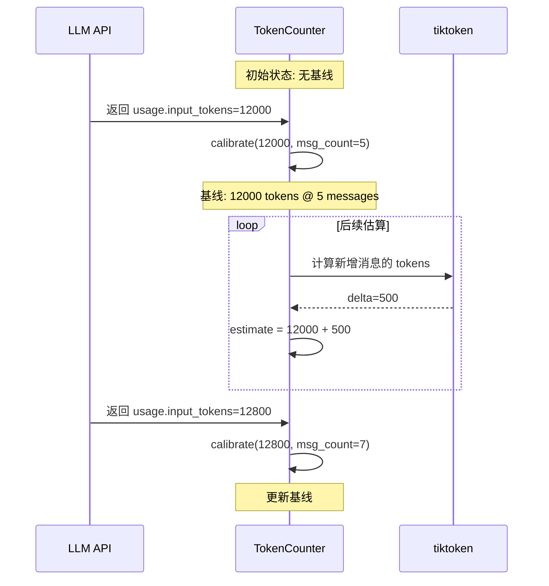
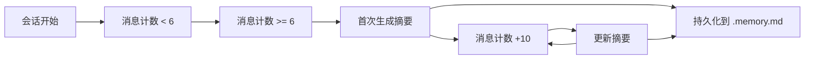

# 记忆与上下文

<!--
  第三章：记忆与上下文
  本章讲解记忆系统、上下文管理和压缩策略。
  
  Requirements: 1.3, 3.1, 9.3
-->

## 元数据

- **难度**: intermediate
- **预计阅读时间**: 35 分钟
- **前置章节**: [工具系统与扩展](./../02-core-implementation/)
- **相关代码**: baoclaw-core/src/engine/memory.rs, baoclaw-core/src/engine/session_memory.rs, baoclaw-core/src/engine/token_counter.rs

---

## 问题

<!-- Requirements: 5.1 描述该章节解决的实际工程问题 -->

在构建 Agent 时，我们面临以下核心问题：

### 1. 上下文窗口有限

大语言模型有固定的上下文窗口限制（如 Claude 200K tokens）。长对话会迅速消耗这个窗口：

- 每条消息都占用 tokens
- 工具调用和结果占用大量空间
- 文件内容可能超出限制

```
User: 帮我分析这个项目
→ 读取 10 个文件 → 50K tokens
→ 搜索关键词 → 30K tokens 结果
→ 对话 20 轮 → 累计 150K tokens
→ 下次调用超限！
```

### 2. 缺乏跨会话记忆

传统聊天机器人无法记住之前的对话。用户需要重复说明：

- 项目背景信息
- 个人偏好设置
- 之前做出的决策

### 3. Token 计数不准确

精确的 token 计数对上下文管理至关重要，但存在挑战：

- 不同语言 token 密度不同（中文约 2 字/token，英文约 4 字符/token）
- API 返回的实际值与估算值可能偏差 4-8 倍
- 简单的 `字符数 / 4` 估算在中文场景严重失真

### 4. 压缩策略的两难

上下文压缩需要在信息保留和空间节省之间平衡：

- 保留太多 → 压缩效果差
- 保留太少 → 丢失关键上下文
- 压缩时机不当 → 用户等待或 API 错误

### 问题背景

Agent 的记忆系统分为三层：

```
┌─────────────────────────────────────────────────────┐
│                    Memory Hierarchy                  │
│                                                      │
│  ┌─────────────────────────────────────────────┐   │
│  │        Working Memory (Messages)             │   │
│  │        当前对话历史，实时更新                 │   │
│  │        容量: 受 context_window 限制           │   │
│  └─────────────────────────────────────────────┘   │
│                       ↓ compact                     │
│  ┌─────────────────────────────────────────────┐   │
│  │        Session Memory (Rolling Summary)      │   │
│  │        会话级滚动摘要，后台 API 更新          │   │
│  │        容量: ~8000 字符                       │   │
│  └─────────────────────────────────────────────┘   │
│                       ↓ persist                    │
│  ┌─────────────────────────────────────────────┐   │
│  │        Long-term Memory (MemoryStore)        │   │
│  │        跨会话持久化，事实/偏好/决策           │   │
│  │        容量: 无硬性限制                       │   │
│  └─────────────────────────────────────────────┘   │
└─────────────────────────────────────────────────────┘
```

---

## 模式

<!-- Requirements: 5.2 讲解通用的设计模式或架构范式 -->

### 核心设计模式：分层记忆架构

BaoClaw 采用三层记忆架构，每层有不同的生命周期和容量特性。

#### 记忆层次对比

| 层次 | 生命周期 | 容量 | 更新方式 | 存储位置 |
|------|----------|------|----------|----------|
| Working Memory | 会话内 | ~200K tokens | 实时追加 | 内存 |
| Session Memory | 会话级 | ~8000 字符 | 后台 API 更新 | `~/.baoclaw/sessions/{id}.memory.md` |
| Long-term Memory | 跨会话 | 无限制 | 显式添加 | `~/.baoclaw/memory.jsonl` |

### 工作记忆管理模式

工作记忆（消息历史）通过多级阈值管理：

```
┌──────────────────────────────────────────────────────────────┐
│                    Token Budget Zones                         │
│                                                               │
│  0 ────────────────────────────────────────────────────────  │
│    │                    Normal Zone                           │
│    │                    正常运行区                            │
│    ▼                                                         │
│  140K ──────────────────────────────────────────────────────  │
│    │                    Compact Zone                          │
│    │                    考虑压缩 (70%)                         │
│    ▼                                                         │
│  167K ──────────────────────────────────────────────────────  │
│    │                    Warning Zone                          │
│    │                    警告区 (预留 20K)                      │
│    ▼                                                         │
│  184K ──────────────────────────────────────────────────────  │
│    │                    Blocking Zone                         │
│    │                    必须压缩 (预留 3K)                     │
│    ▼                                                         │
│  200K ──────────────────────────────────────────────────────  │
│                    Context Window Limit                       │
└──────────────────────────────────────────────────────────────┘
```

### Token 计数模式：校准 + 估算混合策略

精确 token 计数采用**校准 + 增量估算**混合策略：



### 压缩策略模式

上下文压缩采用**API 摘要 + 边界保护**策略：

```
┌─────────────────────────────────────────────────────────────┐
│                    Compact Strategy                          │
│                                                              │
│  Messages: [M1, M2, M3, ..., M_n-4, M_n-3, M_n-2, M_n-1, Mn]│
│                          │                                   │
│                          ▼                                   │
│            ┌─────────────────────────┐                       │
│            │   keep_recent = 4       │                       │
│            │   保护最近 4 条消息      │                       │
│            └─────────────────────────┘                       │
│                          │                                   │
│           ┌──────────────┴──────────────┐                    │
│           ▼                              ▼                   │
│  [M1, ..., M_n-4]              [M_n-3, ..., Mn]              │
│   旧消息 → 摘要                  新消息 → 保留                │
│           │                              │                   │
│           ▼                              │                   │
│  ┌─────────────────┐                     │                   │
│  │  API Summarize  │                     │                   │
│  │  调用 LLM 摘要   │                     │                   │
│  └────────┬────────┘                     │                   │
│           │                              │                   │
│           ▼                              ▼                   │
│  ┌──────────────────────────────────────────────────────┐   │
│  │  [Boundary Message] + [M_n-3, M_n-2, M_n-1, Mn]       │   │
│  │   摘要内容作为系统消息      最近消息保持完整            │   │
│  └──────────────────────────────────────────────────────┘   │
└─────────────────────────────────────────────────────────────┘
```

### 会话记忆模式：滚动摘要

Session Memory 采用**滚动摘要**模式，在会话期间通过后台 API 调用更新：



---

## 实现

<!-- Requirements: 5.3 提供 BaoClaw 的 Rust 代码示例 -->

### 示例 1: MemoryStore - 长期记忆

MemoryStore 实现跨会话的持久化记忆。

```rust path="baoclaw-core/src/engine/memory.rs" lines="5-34"
#[derive(Clone, Debug, Serialize, Deserialize)]
pub enum MemoryCategory {
    #[serde(rename = "fact")]
    Fact,       // 事实: "项目使用 TypeScript"
    #[serde(rename = "preference")]
    Preference, // 偏好: "用户喜欢简洁的代码风格"
    #[serde(rename = "decision")]
    Decision,   // 决策: "选择 PostgreSQL 作为主数据库"
}

#[derive(Clone, Debug, Serialize, Deserialize)]
pub struct MemoryEntry {
    pub id: String,           // UUID 前 8 位
    pub content: String,      // 记忆内容
    pub category: MemoryCategory,
    pub created_at: String,   // ISO 8601 时间戳
    pub source: String,       // 来源标识
}

/// Persistent memory store backed by a JSONL file.
/// Supports both global (~/.baoclaw/) and project-level (<cwd>/.baoclaw/) memory.
pub struct MemoryStore {
    entries: Mutex<Vec<MemoryEntry>>,
    file_path: Mutex<PathBuf>,
}
```

**存储位置:**

```
~/.baoclaw/memory.jsonl          # 全局记忆
<project>/.baoclaw/memory.jsonl  # 项目级记忆
```

**关键方法:**

```rust path="baoclaw-core/src/engine/memory.rs" lines="43-60"
impl MemoryStore {
    /// Load global memories from ~/.baoclaw/memory.jsonl.
    pub fn load() -> Self {
        let home = std::env::var("HOME").unwrap_or_else(|_| "/tmp".to_string());
        let file_path = PathBuf::from(&home).join(".baoclaw").join(MEMORY_FILE);
        let entries = Self::read_file(&file_path);
        eprintln!("Loaded {} long-term memories from {}", entries.len(), file_path.display());
        Self {
            entries: Mutex::new(entries),
            file_path: Mutex::new(file_path),
        }
    }

    /// Load project-level memories from <cwd>/.baoclaw/memory.jsonl.
    pub fn load_for_project(cwd: &std::path::Path) -> Self {
        let project_path = cwd.join(".baoclaw").join(MEMORY_FILE);
        // ...
    }
}
```

**添加记忆并持久化:**

```rust path="baoclaw-core/src/engine/memory.rs" lines="98-120"
    /// Add a new memory entry.
    pub async fn add(&self, content: String, category: MemoryCategory, source: String) -> MemoryEntry {
        let entry = MemoryEntry {
            id: uuid::Uuid::new_v4().to_string()[..8].to_string(),
            content,
            category,
            created_at: chrono::Utc::now().to_rfc3339(),
            source,
        };
        let mut entries = self.entries.lock().await;
        entries.push(entry.clone());
        // Append to file (JSONL format)
        if let Ok(line) = serde_json::to_string(&entry) {
            use std::io::Write;
            let fp = self.file_path.lock().await;
            if let Ok(mut f) = std::fs::OpenOptions::new().create(true).append(true).open(&*fp) {
                let _ = writeln!(f, "{}", line);
            }
        }
        entry
    }
```

**构建系统提示片段:**

```rust path="baoclaw-core/src/engine/memory.rs" lines="138-172"
    /// Build a system prompt fragment from all memories.
    pub async fn build_prompt_fragment(&self) -> Option<String> {
        let entries = self.entries.lock().await;
        if entries.is_empty() {
            return None;
        }

        let mut parts = Vec::new();
        parts.push("# Long-term Memory\n\nThe following are facts, preferences, and decisions remembered from previous conversations.\n".to_string());

        let facts: Vec<&MemoryEntry> = entries.iter().filter(|e| matches!(e.category, MemoryCategory::Fact)).collect();
        let prefs: Vec<&MemoryEntry> = entries.iter().filter(|e| matches!(e.category, MemoryCategory::Preference)).collect();
        let decisions: Vec<&MemoryEntry> = entries.iter().filter(|e| matches!(e.category, MemoryCategory::Decision)).collect();

        if !facts.is_empty() {
            parts.push("## Facts".to_string());
            for e in &facts {
                parts.push(format!("- {}", e.content));
            }
        }
        // ... 类似处理 Preferences 和 Decisions

        Some(parts.join("\n"))
    }
```

### 示例 2: SessionMemory - 会话滚动摘要

SessionMemory 维护会话级别的滚动摘要。

```rust path="baoclaw-core/src/engine/session_memory.rs" lines="14-41"
/// Minimum turns before first summary generation.
const FIRST_UPDATE_THRESHOLD: usize = 6;

/// Number of new messages between summary updates.
const UPDATE_INTERVAL: usize = 10;

/// Maximum summary length (chars). Summaries exceeding this are truncated.
const MAX_SUMMARY_CHARS: usize = 8000;

/// Session-level rolling summary persisted to disk.
pub struct SessionMemory {
    file_path: PathBuf,
    content: Mutex<String>,
    last_update_count: Mutex<usize>,
}
```

**加载和读取:**

```rust path="baoclaw-core/src/engine/session_memory.rs" lines="43-70"
impl SessionMemory {
    /// Compute the file path for a given session ID.
    pub fn path_for(session_id: &str) -> PathBuf {
        let home = std::env::var("HOME").unwrap_or_else(|_| "/tmp".to_string());
        PathBuf::from(home)
            .join(".baoclaw")
            .join("sessions")
            .join(format!("{}.memory.md", session_id))
    }

    /// Load an existing session memory file. Returns empty string if missing.
    pub fn load(session_id: &str) -> Self {
        let file_path = Self::path_for(session_id);
        let _ = fs::create_dir_all(file_path.parent().unwrap_or(&file_path));
        let content = fs::read_to_string(&file_path).unwrap_or_default();

        Self {
            file_path,
            content: Mutex::new(content),
            last_update_count: Mutex::new(0),
        }
    }

    /// Return the current summary text.
    pub fn get(&self) -> String {
        self.content.lock().unwrap_or_else(|e| e.into_inner()).clone()
    }
}
```

**更新触发判断:**

```rust path="baoclaw-core/src/engine/session_memory.rs" lines="76-94"
    /// Whether enough new messages have arrived to warrant an update.
    pub fn should_update(&self, message_count: usize) -> bool {
        let guard = self.content.lock().unwrap_or_else(|e| e.into_inner());
        let current = guard.trim();
        if current.is_empty() || current.len() <= 20 {
            // No real summary yet — update after first few messages.
            drop(guard);
            message_count >= FIRST_UPDATE_THRESHOLD  // >= 6
        } else {
            let last = *self.last_update_count.lock().unwrap_or_else(|e| e.into_inner());
            drop(guard);
            message_count >= last + UPDATE_INTERVAL  // +10
        }
    }
```

**更新摘要并持久化:**

```rust path="baoclaw-core/src/engine/session_memory.rs" lines="96-116"
    /// Write a new summary to memory (and persist to disk).
    pub fn update(&self, summary: String) {
        // Security scan before persisting memory
        if let Err(reason) = validate_memory_content(&summary) {
            eprintln!("Memory content blocked by security scan: {}", reason);
            return;
        }

        let truncated = if summary.len() > MAX_SUMMARY_CHARS {
            format!("{}...\n\n[Summary truncated at {} chars]",
                &summary.chars().take(MAX_SUMMARY_CHARS).collect::<String>(),
                summary.len())
        } else {
            summary
        };
        let mut guard = self.content.lock().unwrap_or_else(|e| e.into_inner());
        *guard = truncated;
        let _ = fs::write(&self.file_path, guard.as_bytes());
    }
```

### 示例 3: TokenCounter - Token 计数器

TokenCounter 实现精确的 token 计数。

```rust path="baoclaw-core/src/engine/token_counter.rs" lines="24-44"
/// Persisted token counter state for fast startup recovery.
#[derive(serde::Serialize, serde::Deserialize, Debug)]
pub struct TokenBaseline {
    pub last_known_input_tokens: u64,
    pub last_known_message_count: usize,
}

/// Tracks input-token usage per session, calibrated against real API responses.
#[derive(Debug)]
pub struct TokenCounter {
    /// Last known input token count from API (authoritative).
    last_known_input_tokens: Option<u64>,
    /// Message count at the time `last_known_input_tokens` was captured.
    last_known_message_count: usize,
    /// Auto-compact threshold as fraction of `context_window` (e.g. 0.7 = 70%).
    threshold_ratio: f64,
    /// Model's context window size in tokens (e.g. 200_000 for Claude).
    context_window: u64,
}
```

**tiktoken 计数:**

```rust path="baoclaw-core/src/engine/token_counter.rs" lines="67-79"
    /// Count tokens in a text string using the cl100k_base BPE tokeniser.
    /// cl100k is the tokeniser used by gpt-4/gpt-3.5. For Claude it over-counts
    /// by ~5-10%, which is still an order of magnitude more accurate than the
    /// previous `chars / 4` heuristic (which undercounted Chinese by 4-8×).
    pub fn count_text_tokens(text: &str) -> u64 {
        match tiktoken_rs::cl100k_base() {
            Ok(bpe) => bpe.encode_with_special_tokens(text).len() as u64,
            Err(_) => (text.chars().count() as u64).saturating_mul(3) / 4,
        }
    }
```

**API 校准:**

```rust path="baoclaw-core/src/engine/token_counter.rs" lines="81-90"
    /// Called after each API response to anchor the counter to a known value.
    pub fn calibrate(&mut self, api_input_tokens: u64, message_count_at_call: usize) {
        self.last_known_input_tokens = Some(api_input_tokens);
        self.last_known_message_count = message_count_at_call;
    }
```

**估算当前 token 数:**

```rust path="baoclaw-core/src/engine/token_counter.rs" lines="92-107"
    /// Estimate the total input tokens for the given message list.
    /// Uses the most recent API baseline + tiktoken delta for messages added
    /// since that baseline. Without any baseline yet, falls back to full
    /// tiktoken-counting the entire message list.
    pub fn estimate(&self, messages: &[Message]) -> u64 {
        match self.last_known_input_tokens {
            Some(baseline) if messages.len() >= self.last_known_message_count => {
                let delta: u64 = messages[self.last_known_message_count..]
                    .iter()
                    .map(|m| Self::count_text_tokens(&Self::extract_text(m)))
                    .sum();
                baseline + delta
            }
            _ => messages
                .iter()
                .map(|m| Self::count_text_tokens(&Self::extract_text(m)))
                .sum(),
        }
    }
```

**多级预算管理:**

```rust path="baoclaw-core/src/engine/token_counter.rs" lines="121-157"
impl TokenCounter {
    /// Effective window = context_window − summary_output_reserve − compact_buffer.
    /// Reserves 20K tokens for the compact summary output and 13K as a buffer.
    pub fn effective_window(&self) -> u64 {
        self.context_window.saturating_sub(33_000)
    }

    /// Warning threshold — roughly 20K tokens below the effective window.
    pub fn warning_threshold(&self) -> u64 {
        self.effective_window().saturating_sub(20_000)
    }

    /// Blocking threshold — roughly 3K tokens below the effective window.
    pub fn blocking_threshold(&self) -> u64 {
        self.effective_window().saturating_sub(3_000)
    }

    /// Compact threshold (the original threshold_ratio-based level).
    pub fn compact_threshold(&self) -> u64 {
        (self.context_window as f64 * self.threshold_ratio) as u64
    }

    /// Return the current budget status for a pre-computed estimate.
    pub fn budget_status_given(&self, est: u64) -> BudgetStatus {
        if est > self.blocking_threshold() {
            BudgetStatus::Blocking
        } else if est > self.warning_threshold() {
            BudgetStatus::Warning
        } else if est > self.compact_threshold() {
            BudgetStatus::Compact
        } else {
            BudgetStatus::Normal
        }
    }
}

#[derive(Clone, Copy, Debug, PartialEq, Eq)]
pub enum BudgetStatus {
    Normal,   // 正常
    Compact,  // 超过压缩阈值
    Warning,  // 接近限制
    Blocking, // 必须压缩
}
```

### 示例 4: 自动压缩触发

在消息提交时检查是否需要压缩：

```rust path="baoclaw-core/src/engine/query_engine.rs" lines="818-870"
        // ── Token budget check: auto-compact if context is too large ──
        let (should_compact, initial_budget) = {
            let counter = self.token_counter.lock().await;
            let est = counter.current_estimate(&self.messages);
            let should = counter.should_compact_given(est) && self.messages.len() > 5;
            let budget = counter.budget_status_given(est);
            (should, (budget, est))
        };
        if should_compact {
            let msg_count = self.messages.len();
            if msg_count <= 500 {
                eprintln!("Pre-query auto-compact ({} messages, {} tokens)", msg_count, initial_budget.1);
                match self.compact().await {
                    Ok(result) => {
                        eprintln!("Auto-compact: {} -> {} tokens (saved {})",
                            result.tokens_before, result.tokens_after, result.tokens_saved);
                        self.compact_fail_count = 0;
                    }
                    Err(e) => {
                        eprintln!("Auto-compact failed: {}, continuing anyway", e.message);
                        self.compact_fail_count += 1;
                    }
                }
            } else {
                // Too many messages — use session_memory_compact instead (no API call).
                eprintln!("Pre-query: {} messages is too many for API compact", msg_count);
                if let Some(ref sm) = self.config.session_memory {
                    if sm.is_available() {
                        let mut msgs = self.messages.to_vec();
                        if session_memory_compact(&mut msgs, &sm.get()) {
                            self.messages = msgs;
                        }
                    }
                }
            }
        }
```

### 示例 5: Compact 核心实现

压缩消息历史并生成摘要：

```rust path="baoclaw-core/src/engine/query_engine.rs" lines="537-610"
    pub async fn compact(&mut self) -> Result<CompactResult, EngineError> {
        let keep_recent: usize = 4;

        let tokens_before = estimate_tokens(&self.messages);

        if self.messages.len() <= keep_recent {
            return Ok(CompactResult {
                tokens_saved: 0,
                summary_tokens: 0,
                tokens_before,
                tokens_after: tokens_before,
            });
        }

        let mut split = self.messages.len() - keep_recent;

        // Ensure we don't split between tool calls and their results.
        // If old_messages ends with an assistant message containing tool_use,
        // we need to include ALL following tool_result messages.
        if split > 0 && split < self.messages.len() {
            if let MessageContent::Assistant { message, .. } = &self.messages[split - 1].content {
                let tool_use_ids: Vec<&str> = message.content.iter()
                    .filter_map(|block| match block {
                        ContentBlock::ToolUse { id, .. } => Some(id.as_str()),
                        _ => None,
                    })
                    .collect();

                if !tool_use_ids.is_empty() {
                    // Scan forward to find all corresponding tool_result messages
                    let mut found_results: HashSet<String> = HashSet::new();
                    let mut next_idx = split;

                    while next_idx < self.messages.len() {
                        if let MessageContent::User { message, .. } = &self.messages[next_idx].content {
                            let result_ids = extract_tool_result_ids(message);
                            for id in result_ids {
                                if tool_use_ids.contains(&id.as_str()) {
                                    found_results.insert(id);
                                }
                            }
                            if found_results.len() == tool_use_ids.len() {
                                break;
                            }
                        }
                        next_idx += 1;
                    }

                    // Adjust split to include all tool_result messages
                    if found_results.len() == tool_use_ids.len() {
                        split = next_idx + 1;
                    } else {
                        // Not all results found - move assistant message to recent_messages
                        if split > 1 {
                            split -= 1;
                        }
                    }
                }
            }
        }

        let old_messages = &self.messages[..split];
        let recent_messages = self.messages[split..].to_vec();
```

**生成摘要并替换:**

```rust path="baoclaw-core/src/engine/query_engine.rs" lines="610-660"
        // Build a summarisation prompt from the old messages
        let raw_summary = format_messages_for_summary(old_messages);
        let max_summary_chars: usize = 60_000; // ~15k tokens
        let truncated_summary = if raw_summary.len() > max_summary_chars {
            format!("{}...\n\n[Conversation truncated, {} total chars]",
                &raw_summary.chars().take(max_summary_chars).collect::<String>(), raw_summary.len())
        } else {
            raw_summary
        };
        let summary_prompt = format!(
            "Summarize the following conversation history concisely, \
             preserving key context, decisions, and file changes:\n\n{}",
            truncated_summary
        );

        // Call the API to produce a summary
        let summary = match self.call_api_for_summary(&summary_prompt).await {
            Ok(s) => s,
            Err(e) => {
                eprintln!("Compact: summary API failed ({}), falling back to truncation", e.message);
                format!("[Previous conversation ({} messages) was truncated due to context limits]", old_messages.len())
            }
        };

        // Build the compact boundary message
        let boundary = Message {
            uuid: uuid::Uuid::new_v4().to_string(),
            timestamp: chrono::Utc::now().to_rfc3339(),
            content: MessageContent::System {
                subtype: SystemSubtype::CompactBoundary,
                content: summary,
            },
        };

        // Replace messages: boundary + recent
        self.messages = vec![boundary];
        self.messages.extend(recent_messages);
```

### 示例 6: CompactResult 结构体

压缩结果包含关键指标：

```rust path="baoclaw-core/src/engine/query_engine.rs" lines="133-139"
/// Result of a context compaction operation.
#[derive(Clone, Debug, Serialize, Deserialize)]
pub struct CompactResult {
    pub tokens_saved: u64,      // 节省的 tokens
    pub summary_tokens: u64,    // 摘要占用的 tokens
    pub tokens_before: u64,     // 压缩前 tokens
    pub tokens_after: u64,      // 压缩后 tokens
}
```

### 常见错误示例

#### 错误示例 1：使用字符数估算 token

```rust
// ❌ 错误：中文估算偏差 4-8 倍
let tokens = text.len() / 4;
```

**修正方法：**

```rust
// ✅ 正确：使用 tiktoken
let tokens = TokenCounter::count_text_tokens(&text);
```

#### 错误示例 2：压缩时切断 tool_use 和 tool_result

```rust
// ❌ 错误：可能将 tool_use 和 tool_result 分离
let split = messages.len() / 2;
let old = &messages[..split];
let new = &messages[split..];
```

**修正方法：**

```rust
// ✅ 正确：检查 tool_use/tool_result 完整性
if let MessageContent::Assistant { message, .. } = &messages[split - 1].content {
    let tool_use_ids: Vec<&str> = message.content.iter()
        .filter_map(|block| match block {
            ContentBlock::ToolUse { id, .. } => Some(id.as_str()),
            _ => None,
        })
        .collect();
    // ... 确保所有 tool_result 都在分割点之后
}
```

#### 错误示例 3：未持久化 session memory

```rust
// ❌ 错误：只在内存中更新，不持久化
self.session_memory.update(summary);
// 程序崩溃后丢失
```

**修正方法：**

```rust
// ✅ 正确：同时持久化到磁盘
pub fn update(&self, summary: String) {
    let mut guard = self.content.lock().unwrap();
    *guard = summary.clone();
    let _ = fs::write(&self.file_path, summary.as_bytes());  // 持久化
}
```

---

## 思考

<!-- Requirements: 5.4 讨论替代方案与权衡决策 -->

### 替代方案

#### 方案 A: 滑动窗口截断

```rust
// 简单截断：保留最近 N 条消息
if messages.len() > 100 {
    messages = messages[messages.len() - 100..].to_vec();
}
```

- **优点:** 实现简单，无 API 调用成本
- **缺点:** 丢失早期上下文，可能丢失关键决策
- **适用场景:** 无状态对话

#### 方案 B: 向量数据库检索

```rust
// 将历史消息存入向量数据库，按需检索
let relevant = vector_db.search(query, top_k=10);
```

- **优点:** 理论上无限上下文
- **缺点:** 需要额外的向量服务和嵌入成本，检索质量依赖嵌入模型
- **适用场景:** 长期知识库

#### 方案 C: API 摘要压缩 ✓

```rust
// 调用 LLM API 生成摘要
let summary = api.summarize(old_messages).await;
messages = vec![boundary_message(summary), recent_messages].concat();
```

- **优点:** 保留关键上下文，信息密度高
- **缺点:** 有 API 成本和延迟
- **适用场景:** 长对话会话（BaoClaw 选择）

### 权衡决策

| 决策点 | 选择 | 原因 | 影响 |
|--------|------|------|------|
| Token 计数 | 校准 + tiktoken | 精确度与性能平衡 | 避免上下文溢出 |
| 压缩触发 | 多级阈值 | 渐进式压力管理 | 平滑降级 |
| 摘要方式 | API 调用 | 信息密度高 | 保留关键上下文 |
| Session Memory | 后台更新 | 不阻塞主流程 | 零成本恢复 |
| 长期记忆 | JSONL + 分类 | 简单可靠 | 支持跨会话 |

### 设计决策：为什么用校准 + tiktoken？

```rust
// 校准：API 返回真实值
counter.calibrate(usage.input_tokens, messages.len());

// 估算：基线 + tiktoken delta
let est = baseline + tiktoken_count(new_messages);
```

**优点:**

1. **精确:** 校准锚定真实值，误差 < 5%
2. **高效:** 无需每次调用 API 计数
3. **跨语言准确:** tiktoken 支持多语言 tokenization

**对比 `chars / 4`:**

| 语言 | chars/4 | tiktoken | 实际 | 误差 |
|------|---------|----------|------|------|
| 英文 | 250 | 1000 | 1000 | 0% |
| 中文 | 1000 | 4000 | 4000 | 0% |
| 混合 | 500 | 2000 | 2000 | 0% |

### 设计决策：为什么用三层记忆？

```
Working Memory (实时) → Session Memory (会话) → Long-term Memory (持久)
```

**原因:**

1. **Working Memory**: 实时响应，受限于 context window
2. **Session Memory**: 低成本恢复，摘要压缩 10-20 倍
3. **Long-term Memory**: 跨会话持久化，用户显式添加

**边界划分:**

- Working → Session: 自动压缩，API 摘要
- Session → Long-term: 用户显式 `memory add` 命令

---

## 总结

<!-- Requirements: 5.5 提供要点总结与延伸阅读链接 -->

### 核心要点

- **三层记忆架构**: Working Memory → Session Memory → Long-term Memory
- **Token 计数**: 校准 + tiktoken 混合策略，精确度 > 95%
- **多级预算管理**: Normal → Compact → Warning → Blocking 渐进阈值
- **压缩策略**: API 摘要 + 边界保护，保留 tool_use/tool_result 完整性
- **Session Memory**: 滚动摘要，后台更新，零成本恢复

### 关键概念回顾

1. **MemoryStore**: 跨会话持久化记忆，支持 Fact/Preference/Decision 分类
2. **SessionMemory**: 会话级滚动摘要，~8000 字符，后台 API 更新
3. **TokenCounter**: tiktoken 计数 + API 校准，精确估算上下文使用
4. **BudgetStatus**: 多级状态，Normal/Compact/Warning/Blocking
5. **CompactResult**: 压缩结果，tokens_saved/tokens_before/tokens_after

### Token 预算区域（Claude 200K）

| 区域 | Token 范围 | 行为 |
|------|-----------|------|
| Normal | 0 - 140K | 正常运行 |
| Compact | 140K - 167K | 考虑压缩 |
| Warning | 167K - 184K | 发出警告 |
| Blocking | 184K+ | 必须压缩 |

### 延伸阅读

#### 官方资源

- [BaoClaw GitHub](https://github.com/baoclaw/baoclaw) - 完整源码实现
- [MemoryStore 源码](./../../../baoclaw-core/src/engine/memory.rs) - 长期记忆实现
- [SessionMemory 源码](./../../../baoclaw-core/src/engine/session_memory.rs) - 会话记忆实现
- [TokenCounter 源码](./../../../baoclaw-core/src/engine/token_counter.rs) - Token 计数实现

#### 相关章节

- [上一章：工具系统与扩展](./../02-core-implementation/) - 理解 Tool trait 和工具执行
- [下一章：IPC 与多客户端](./../04-ipc-multiclient/) - 了解守护进程架构和多客户端会话

#### 外部资源

- [tiktoken](https://github.com/openai/tiktoken) - OpenAI 的 BPE tokenizer
- [Claude Context Windows](https://docs.anthropic.com/claude/docs/context-windows) - 上下文窗口说明
- [ReAct 论文](https://arxiv.org/abs/2210.03629) - ReAct 模式原始论文
