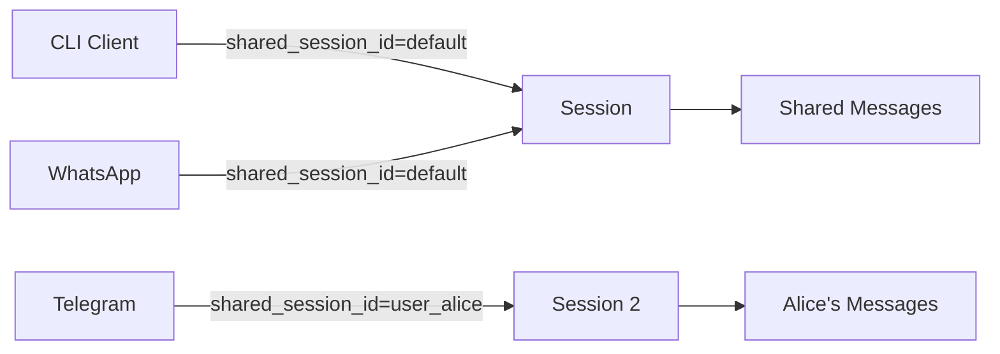
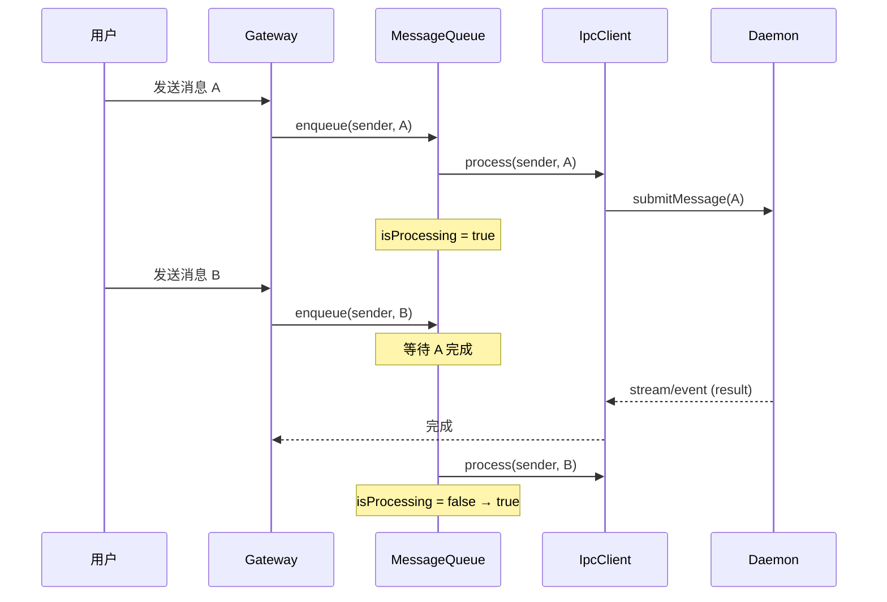

# IPC 与多客户端

<!--
  第四章：IPC 与多客户端
  本章讲解守护进程架构、IPC 协议和多客户端接入。
  
  Requirements: 1.4, 3.1, 9.3
-->

## 元数据

- **难度**: intermediate
- **预计阅读时间**: 35 分钟
- **前置章节**: [记忆与上下文](./../03-memory-context/)
- **相关代码**: baoclaw-core/src/ipc/, ts-ipc/, baoclaw-whatsapp/src/gateway.ts, baoclaw-telegram/src/gateway.ts

---

## 问题

<!-- Requirements: 5.1 描述该章节解决的实际工程问题 -->

在构建 Agent 应用时，我们面临以下核心问题：

### 1. 如何让 Agent 在后台持久运行？

传统 CLI 程序每次调用都需要重新启动，存在以下问题：

- 启动时间长（加载模型、初始化工具）
- 无法保持会话状态
- 每次重新加载 MCP 服务器

### 2. 如何支持多渠道同时访问？

用户可能通过多种方式与 Agent 交互：

- 终端 CLI（本地开发）
- 即时通讯工具（Telegram、WhatsApp）
- 企业协作平台（飞书、钉钉）

每种渠道需要独立的客户端，但共享同一个 Agent 核心。

### 3. 如何实现进程间通信？

客户端与守护进程运行在不同进程，需要可靠的通信机制：

- 低延迟：实时响应用户请求
- 高吞吐：处理大量流事件
- 容错性：处理异常断开和重连

### 4. 如何隔离不同用户的会话？

多用户场景下需要确保：

- 会话隔离：用户 A 看不到用户 B 的对话
- 权限控制：不同用户有不同的访问权限
- 资源管理：防止单用户占用过多资源

### 问题背景

BaoClaw 采用 **守护进程模式 + JSON-RPC over Unix Domain Socket** 架构解决上述问题。守护进程作为全局后台服务管理所有 Agent 实例，客户端通过标准的 JSON-RPC 协议连接，支持会话共享和多渠道接入。

```
┌─────────────────────────────────────────────────────────────────────┐
│                        BaoClaw Daemon                                │
│  ┌─────────────┐   ┌─────────────┐   ┌─────────────────────────┐   │
│  │ IpcServer   │→  │ Router      │→  │ QueryEngine             │   │
│  │ (UDS)       │   │             │   │                         │   │
│  └─────────────┘   └─────────────┘   └─────────────────────────┘   │
│         ↑                                     │                      │
│         │                                     ▼                      │
│  ┌─────────────┐   ┌─────────────┐   ┌─────────────────────────┐   │
│  │ Events      │←  │ ToolExecutor│←  │ Stream Events           │   │
│  │             │   │             │   │ (assistant_chunk, etc.) │   │
│  └─────────────┘   └─────────────┘   └─────────────────────────┘   │
└─────────────────────────────────────────────────────────────────────┘
         │
         │ Unix Domain Socket (NDJSON)
         ▼
┌─────────────────────────────────────────────────────────────────────┐
│                        IPC Clients                                   │
│  ┌─────────────┐   ┌─────────────┐   ┌─────────────────────────┐   │
│  │ CLI Client  │   │ WhatsApp    │   │ Telegram / Feishu       │   │
│  │ (ts-ipc)    │   │ Gateway     │   │ Gateway                 │   │
│  └─────────────┘   └─────────────┘   └─────────────────────────┘   │
└─────────────────────────────────────────────────────────────────────┘
```

---

## 模式

<!-- Requirements: 5.2 讲解通用的设计模式或架构范式 -->

### 核心设计模式：守护进程 + IPC 网关

BaoClaw 采用**守护进程模式**，将 Agent 核心与客户端解耦，通过 JSON-RPC 协议通信。

#### 守护进程模式优势

| 优势 | 说明 | 对比传统 CLI |
|------|------|-------------|
| 持久化 | Agent 在后台持续运行 | 每次启动需重新初始化 |
| 会话保持 | 自动保存和恢复会话 | 手动管理会话状态 |
| 多客户端 | 支持多渠道同时连接 | 每个渠道独立进程 |
| 资源共享 | MCP 服务器全局共享 | 每次重启需重新加载 |

#### JSON-RPC 2.0 协议

JSON-RPC 2.0 是轻量级的远程过程调用协议：

```json
// 请求
{
  "jsonrpc": "2.0",
  "method": "submitMessage",
  "params": { "prompt": "Hello" },
  "id": 1
}

// 成功响应
{
  "jsonrpc": "2.0",
  "result": { "status": "ok" },
  "id": 1
}

// 通知（无 id，无需响应）
{
  "jsonrpc": "2.0",
  "method": "stream/event",
  "params": { "type": "assistant_chunk", "content": "..." }
}
```

#### Unix Domain Socket vs TCP

| 特性 | Unix Domain Socket | TCP |
|------|-------------------|-----|
| 通信范围 | 本机 | 网络 |
| 性能 | 更快（无网络栈开销） | 较慢 |
| 安全 | 文件权限控制 | 需额外认证 |
| 适用场景 | 本地服务（BaoClaw） | 分布式服务 |

#### NDJSON 帧格式

NDJSON (Newline-Delimited JSON) 是流式 JSON 格式：

```
{"jsonrpc":"2.0","method":"stream/event","params":{...}}\n
{"jsonrpc":"2.0","method":"stream/event","params":{...}}\n
{"jsonrpc":"2.0","result":{...},"id":1}\n
```

**优势：**

- 流式处理友好，无需预先知道消息长度
- 天然支持消息边界
- 便于调试（每行一个完整 JSON）

### 多客户端架构

#### 统一 IPC 客户端模式

所有网关使用相同的 IPC 客户端实现模式：

```
┌─────────────────────────────────────────────────────────────────────┐
│                        Gateway Pattern                               │
│                                                                      │
│  ┌───────────────────────────────────────────────────────────────┐ │
│  │                     Gateway (TypeScript)                        │ │
│  │  ┌─────────────┐  ┌─────────────┐  ┌─────────────────────┐    │ │
│  │  │ Platform    │  │ IpcClient   │  │ MessageQueue        │    │ │
│  │  │ Client      │  │             │  │                     │    │ │
│  │  │ (WhatsApp/  │  │ - connect() │  │ - enqueue()         │    │ │
│  │  │  Telegram)  │  │ - request() │  │ - dequeue()         │    │ │
│  │  └──────┬──────┘  │ - onNotify()│  │ - isProcessing()    │    │ │
│  │         │         └──────┬──────┘  └─────────────────────┘    │ │
│  │         │                │                                     │ │
│  │         ▼                ▼                                     │ │
│  │  ┌─────────────────────────────────────────────────────────┐  │ │
│  │  │              Unix Domain Socket                          │  │ │
│  │  └─────────────────────────────────────────────────────────┘  │ │
│  └───────────────────────────────────────────────────────────────┘ │
│                                │                                     │
│                                ▼                                     │
│                    ┌─────────────────────┐                          │
│                    │   BaoClaw Daemon    │                          │
│                    └─────────────────────┘                          │
└─────────────────────────────────────────────────────────────────────┘
```

#### 网关实现对比

| 网关 | 平台客户端 | IPC 客户端 | 特点 |
|------|-----------|-----------|------|
| CLI | readline | ts-ipc/client.ts | 交互式终端 |
| WhatsApp | Baileys | baoclaw-whatsapp/ipcClient.ts | QR 码登录，媒体支持 |
| Telegram | node-telegram-bot-api | 内联实现 | Polling 模式 |
| Feishu | lark-cli | baoclaw-feishu/ipcClient.ts | NDJSON 事件流 |

### 会话共享模式

多个客户端可以通过 `shared_session_id` 共享同一个会话：



**用途：** 不同渠道的用户可以共享同一对话历史，实现无缝切换。

### 消息队列模式

每个网关实现自己的消息队列，确保：

- 每个发送者一次只处理一条消息
- 按顺序处理，不乱序
- 支持队列满时的背压



### 守护进程发现机制

客户端通过元数据文件发现运行中的守护进程：

```
/tmp/baoclaw-sockets/
├── default.json          # 默认会话
├── project-alpha.json    # 项目 alpha
└── project-beta.json     # 项目 beta
```

**元数据结构：**

```typescript
interface DaemonInfo {
  pid: number;          // 进程 ID
  cwd: string;          // 工作目录
  session_id: string;   // 会话 ID
  socket: string;       // Socket 路径
  started_at: string;   // 启动时间 (ISO 8601)
}
```

**发现流程：**

1. 扫描 `/tmp/baoclaw-sockets/*.json`
2. 检查进程存活（`process.kill(pid, 0)`）
3. 检查 socket 文件存在
4. 选择匹配 cwd 或最新的守护进程

---

## 实现

<!-- Requirements: 5.3 提供 BaoClaw 的 Rust 代码示例 -->

### 示例 1: JSON-RPC 协议定义

JSON-RPC 2.0 消息类型定义。

```rust path="baoclaw-core/src/ipc/protocol.rs" lines="15-60"
// 请求 ID - 支持数字或字符串
#[derive(Clone, Debug, Serialize, Deserialize, PartialEq)]
#[serde(untagged)]
pub enum RequestId {
    Number(i64),
    String(String),
}

// JSON-RPC 2.0 请求
#[derive(Clone, Debug, Serialize, Deserialize)]
pub struct JsonRpcRequest {
    pub jsonrpc: String,           // "2.0"
    pub method: String,            // RPC 方法名
    #[serde(default)]
    pub params: Value,             // 参数（可选）
    pub id: RequestId,             // 请求 ID
}

// JSON-RPC 2.0 成功响应
#[derive(Clone, Debug, Serialize, Deserialize)]
pub struct JsonRpcResponse {
    pub jsonrpc: String,
    pub result: Value,             // 结果
    pub id: RequestId,
}

// JSON-RPC 2.0 错误响应
#[derive(Clone, Debug, Serialize, Deserialize)]
pub struct JsonRpcErrorResponse {
    pub jsonrpc: String,
    pub error: JsonRpcError,
    pub id: Option<RequestId>,     // 可能为 None（解析错误）
}

#[derive(Clone, Debug, Serialize, Deserialize)]
pub struct JsonRpcError {
    pub code: i32,
    pub message: String,
    #[serde(skip_serializing_if = "Option::is_none")]
    pub data: Option<Value>,
}
```

**设计要点：**

- `RequestId` 使用 `#[serde(untagged)]` 支持 JSON-RPC 规范中的数字或字符串 ID
- 错误响应的 `id` 可为 `None`（如解析错误时无法确定请求 ID）

### 示例 2: 统一消息类型

自定义反序列化逻辑，根据 JSON 字段自动判断消息类型。

```rust path="baoclaw-core/src/ipc/protocol.rs" lines="62-120"
#[derive(Clone, Debug)]
pub enum JsonRpcMessage {
    Request(JsonRpcRequest),
    Response(JsonRpcResponse),
    ErrorResponse(JsonRpcErrorResponse),
    Notification(JsonRpcNotification),
}

impl<'de> Deserialize<'de> for JsonRpcMessage {
    fn deserialize<D>(deserializer: D) -> Result<Self, D::Error>
    where
        D: serde::Deserializer<'de>,
    {
        let value = Value::deserialize(deserializer)?;
        
        // 有 error 字段 → ErrorResponse
        if value.get("error").is_some() {
            return Ok(JsonRpcMessage::ErrorResponse(
                serde_json::from_value(value).map_err(serde::de::Error::custom)?
            ));
        }
        
        // 有 result 字段 → Response
        if value.get("result").is_some() {
            return Ok(JsonRpcMessage::Response(
                serde_json::from_value(value).map_err(serde::de::Error::custom)?
            ));
        }
        
        // 有 method 字段
        if let Some(_method) = value.get("method") {
            // 有 id → Request
            if value.get("id").is_some() {
                return Ok(JsonRpcMessage::Request(
                    serde_json::from_value(value).map_err(serde::de::Error::custom)?
                ));
            }
            // 无 id → Notification
            return Ok(JsonRpcMessage::Notification(
                serde_json::from_value(value).map_err(serde::de::Error::custom)?
            ));
        }
        
        Err(serde::de::Error::custom("Invalid JSON-RPC message"))
    }
}
```

### 示例 3: NDJSON 帧格式

编码和解码 NDJSON 消息。

```rust path="baoclaw-core/src/ipc/protocol.rs" lines="130-160"
// 编码：JSON + 换行符
pub fn encode_ndjson(message: &impl Serialize) -> Result<Vec<u8>, serde_json::Error> {
    let mut bytes = serde_json::to_vec(message)?;
    bytes.push(b'\n');
    Ok(bytes)
}

// 解码：单行 JSON → JsonRpcMessage
pub fn decode_ndjson_line(line: &str) -> Result<JsonRpcMessage, serde_json::Error> {
    let trimmed = line.trim();
    if trimmed.is_empty() {
        return Err(serde_json::Error::custom("Empty line"));
    }
    serde_json::from_str(trimmed)
}
```

### 示例 4: IPC 服务端

IPC 服务端监听 Unix Domain Socket。

```rust path="baoclaw-core/src/ipc/server.rs" lines="35-80"
/// IPC 服务端 - 监听 Unix Domain Socket
pub struct IpcServer {
    listener: UnixListener,
    socket_path: PathBuf,
}

impl IpcServer {
    /// Create and bind to a Unix Domain Socket.
    /// Cleans up old socket file if exists, sets permissions to 0600.
    pub async fn bind(socket_path: PathBuf) -> Result<Self, IpcError> {
        // Remove old socket file if exists
        if socket_path.exists() {
            std::fs::remove_file(&socket_path)
                .map_err(|e| IpcError::BindFailed(e.to_string()))?;
        }
        
        // Create parent directory
        if let Some(parent) = socket_path.parent() {
            std::fs::create_dir_all(parent)
                .map_err(|e| IpcError::BindFailed(e.to_string()))?;
        }
        
        // Bind listener
        let listener = UnixListener::bind(&socket_path)
            .map_err(|e| IpcError::BindFailed(e.to_string()))?;
        
        // Set permissions to 0600 (only owner can access)
        std::fs::set_permissions(&socket_path, std::fs::Permissions::from_mode(0o600))
            .map_err(|e| IpcError::BindFailed(e.to_string()))?;
        
        Ok(Self { listener, socket_path })
    }
}

impl Drop for IpcServer {
    fn drop(&mut self) {
        // Clean up socket file on drop
        let _ = std::fs::remove_file(&self.socket_path);
    }
}
```

**安全特性：**

- 自动清理旧 socket 文件，避免 "address already in use"
- 设置 0600 权限，防止其他用户连接
- 析构时自动清理 socket 文件

### 示例 5: IPC 连接读写

IPC 连接支持带缓冲的 NDJSON 读写。

```rust path="baoclaw-core/src/ipc/server.rs" lines="82-130"
/// IPC 连接 - 带缓冲的读写
pub struct IpcConnection {
    reader: BufReader<tokio::net::unix::OwnedReadHalf>,
    writer: BufWriter<tokio::net::unix::OwnedWriteHalf>,
}

impl IpcConnection {
    /// Read a single NDJSON message.
    pub async fn read_message(&mut self) -> Result<JsonRpcMessage, IpcError> {
        let mut line = String::new();
        let n = self.reader.read_line(&mut line).await
            .map_err(|e| IpcError::ReadFailed(e.to_string()))?;
        
        if n == 0 {
            return Err(IpcError::ConnectionClosed);
        }
        
        decode_ndjson_line(&line)
            .map_err(|e| IpcError::ParseFailed(e.to_string()))
    }
    
    /// Write a single NDJSON message.
    pub async fn write_message(&mut self, message: &impl Serialize) -> Result<(), IpcError> {
        let bytes = encode_ndjson(message)
            .map_err(|e| IpcError::EncodeFailed(e.to_string()))?;
        
        self.writer.write_all(&bytes).await
            .map_err(|e| IpcError::WriteFailed(e.to_string()))?;
        
        self.writer.flush().await
            .map_err(|e| IpcError::WriteFailed(e.to_string()))?;
        
        Ok(())
    }
}
```

### 示例 6: RPC 路由定义

定义客户端可调用的 RPC 方法。

```rust path="baoclaw-core/src/ipc/router.rs" lines="25-80"
#[derive(Clone, Debug, Serialize, Deserialize, PartialEq)]
#[serde(tag = "method", content = "params")]
pub enum ClientMethod {
    #[serde(rename = "initialize")]
    Initialize {
        cwd: PathBuf,
        model: Option<String>,
        settings: Value,
        #[serde(default)]
        resume_session_id: Option<String>,
        #[serde(default)]
        shared_session_id: Option<String>,
    },

    #[serde(rename = "submitMessage")]
    SubmitMessage {
        prompt: Value,
        uuid: Option<String>,
        #[serde(default)]
        attachments: Option<Vec<Value>>,
    },

    #[serde(rename = "permissionResponse")]
    PermissionResponse {
        tool_use_id: String,
        decision: String,
        rule: Option<String>,
    },

    #[serde(rename = "abort")]
    Abort,

    #[serde(rename = "listTools")]
    ListTools,

    #[serde(rename = "listMcpServers")]
    ListMcpServers,

    #[serde(rename = "compact")]
    Compact,

    #[serde(rename = "switchModel")]
    SwitchModel {
        model: String,
    },
    
    // ... 更多方法
}
```

**设计要点：**

- 使用 `#[serde(tag = "method", content = "params")]` 实现方法名到参数类型的映射
- 支持 `#[serde(default)]` 处理可选参数

### 示例 7: 事件层

引擎事件转换为 stream/event 通知。

```rust path="baoclaw-core/src/ipc/events.rs" lines="15-50"
/// 引擎事件 → stream/event 通知
pub fn engine_event_to_notification(event: &EngineEvent) -> JsonRpcNotification {
    JsonRpcNotification::new(
        "stream/event",
        serde_json::to_value(event).unwrap_or(Value::Null),
    )
}

/// 通知结构
#[derive(Clone, Debug, Serialize, Deserialize)]
pub struct JsonRpcNotification {
    pub jsonrpc: String,
    pub method: String,
    pub params: Value,
}

impl JsonRpcNotification {
    pub fn new(method: &str, params: Value) -> Self {
        Self {
            jsonrpc: "2.0".to_string(),
            method: method.to_string(),
            params,
        }
    }
}
```

**流事件类型：**

| 事件类型 | 说明 | 参数 |
|---------|------|------|
| `TurnStart` | 回合开始 | `turn_id` |
| `AssistantChunk` | AI 输出文本块 | `content`, `tool_use_id` |
| `ThinkingChunk` | 思考过程块 | `content` |
| `ToolUse` | 工具调用 | `tool_name`, `input`, `tool_use_id` |
| `ToolResult` | 工具结果 | `tool_use_id`, `output`, `is_error` |
| `PermissionRequest` | 权限请求 | `tool_name`, `input`, `message` |
| `Result` | 查询完成 | `status`, `text` |
| `Error` | 错误 | `message` |

### 示例 8: TypeScript IPC 客户端

TypeScript 客户端连接 Unix Domain Socket。

```typescript path="ts-ipc/client.ts" lines="20-70"
export class IpcClient {
  private socket: net.Socket | null = null;
  private buffer = '';
  private nextId = 1;
  private pendingRequests = new Map<number | string, {
    resolve: (value: unknown) => void;
    reject: (error: Error) => void;
    timer: ReturnType<typeof setTimeout>;
  }>();
  private notificationHandlers = new Map<string, NotificationHandler[]>();

  async connect(socketPath: string): Promise<void> {
    return new Promise((resolve, reject) => {
      this.socket = net.createConnection(socketPath, () => {
        resolve();
      });
      
      this.socket.on('data', (data) => {
        this.buffer += data.toString();
        this.processBuffer();
      });
      
      this.socket.on('error', (err) => {
        reject(new Error(`IPC connection error: ${err.message}`));
      });
      
      this.socket.on('close', () => {
        this.cleanup();
      });
    });
  }

  private processBuffer(): void {
    const lines = this.buffer.split('\n');
    this.buffer = lines.pop() || '';  // Keep incomplete line in buffer
    
    for (const line of lines) {
      if (line.trim()) {
        this.handleMessage(JSON.parse(line));
      }
    }
  }
}
```

**请求-响应机制：**

```typescript path="ts-ipc/client.ts" lines="72-120"
  async request<T = unknown>(method: string, params?: unknown, timeout = 30000): Promise<T> {
    return new Promise((resolve, reject) => {
      if (!this.socket) {
        reject(new Error('Not connected'));
        return;
      }
      
      const id = this.nextId++;
      const request = {
        jsonrpc: '2.0',
        method,
        params,
        id,
      };
      
      // Set timeout
      const timer = setTimeout(() => {
        this.pendingRequests.delete(id);
        reject(new Error(`Request ${id} timed out`));
      }, timeout);
      
      // Store pending request
      this.pendingRequests.set(id, {
        resolve: resolve as (value: unknown) => void,
        reject,
        timer,
      });
      
      // Send request
      this.socket.write(JSON.stringify(request) + '\n');
    });
  }

  onNotification(method: string, handler: NotificationHandler): () => void {
    if (!this.notificationHandlers.has(method)) {
      this.notificationHandlers.set(method, []);
    }
    this.notificationHandlers.get(method)!.push(handler);
    
    // Return unsubscribe function
    return () => {
      const handlers = this.notificationHandlers.get(method);
      if (handlers) {
        const index = handlers.indexOf(handler);
        if (index >= 0) handlers.splice(index, 1);
      }
    };
  }
```

### 示例 9: WhatsApp 网关核心组件

WhatsApp 网关展示完整的网关实现。

```typescript path="baoclaw-whatsapp/src/gateway.ts" lines="45-100"
export class Gateway {
  private sessionManager: SessionManager;
  private ipcClient: IpcClient;
  private senderTracker: SenderTracker;
  private permissionManager: PermissionManager;
  private mediaHandler: MediaHandler;
  private messageQueue: MessageQueue;

  async start(): Promise<void> {
    // 1. Initialize WhatsApp session
    await this.sessionManager.connect();
    
    // 2. Discover and connect to daemon
    const daemonInfo = await discoverDaemon(this.config.cwd);
    await this.ipcClient.connect(daemonInfo.socket);
    
    // 3. Initialize IPC session
    await this.ipcClient.request('initialize', {
      cwd: this.config.cwd,
      shared_session_id: this.config.sharedSessionId,
    });
    
    // 4. Subscribe to stream events
    this.ipcClient.onNotification('stream/event', (event) => {
      this.handleStreamEvent(event);
    });
    
    // 5. Start message processing loop
    this.startProcessingLoop();
  }

  private async handleIncomingMessage(msg: Message): Promise<void> {
    // 1. 去重检查
    if (await this.isDuplicate(msg)) return;
    
    // 2. 允许列表检查
    if (!this.isAllowed(msg.sender)) return;
    
    // 3. 速率限制
    if (this.isRateLimited(msg.sender)) return;
    
    // 4. 命令解析
    const text = this.parseCommand(msg.text);
    if (!text) return;
    
    // 5. 消息入队
    this.messageQueue.enqueue(msg.sender, text);
  }
}
```

### 示例 10: 消息队列实现

消息队列确保顺序处理。

```typescript path="baoclaw-whatsapp/src/messageQueue.ts" lines="10-50"
export class MessageQueue {
  private queues = new Map<string, string[]>();
  private processing = new Set<string>();
  private maxSize: number;

  constructor(maxSize = 10) {
    this.maxSize = maxSize;
  }

  enqueue(sender: string, text: string): boolean {
    // Check if queue is full
    const queue = this.queues.get(sender) || [];
    if (queue.length >= this.maxSize) {
      return false;  // Backpressure
    }
    
    queue.push(text);
    this.queues.set(sender, queue);
    return true;
  }

  dequeue(sender: string): string | undefined {
    const queue = this.queues.get(sender);
    if (!queue || queue.length === 0) return undefined;
    
    return queue.shift();
  }

  isProcessing(sender: string): boolean {
    return this.processing.has(sender);
  }

  setProcessing(sender: string, value: boolean): void {
    if (value) {
      this.processing.add(sender);
    } else {
      this.processing.delete(sender);
    }
  }
}
```

### 示例 11: 发送者追踪

追踪发送者状态和响应累积。

```typescript path="baoclaw-whatsapp/src/senderTracker.ts" lines="10-50"
export class SenderTracker {
  // 发送者 → JID 映射
  private senderToJid = new Map<string, string>();
  // 响应累积器
  private accumulators = new Map<string, string>();

  registerSender(phone: string, jid: string, isGroup: boolean): void {
    this.senderToJid.set(phone, jid);
  }

  getJid(phone: string): string | null {
    return this.senderToJid.get(phone) || null;
  }

  accumulate(phone: string, content: string): void {
    const current = this.accumulators.get(phone) || '';
    this.accumulators.set(phone, current + content);
  }

  getAccumulated(phone: string): string {
    return this.accumulators.get(phone) || '';
  }

  clearAccumulator(phone: string): void {
    this.accumulators.delete(phone);
  }
}
```

### 示例 12: 守护进程发现

发现运行中的守护进程。

```typescript path="ts-ipc/cli.ts" lines="150-200"
function discoverDaemons(): DaemonInfo[] {
  const dir = path.join(os.tmpdir(), 'baoclaw-sockets');
  
  if (!fs.existsSync(dir)) return [];
  
  const daemons: DaemonInfo[] = [];
  
  for (const file of fs.readdirSync(dir)) {
    if (!file.endsWith('.json')) continue;
    
    try {
      const content = fs.readFileSync(path.join(dir, file), 'utf-8');
      const info: DaemonInfo = JSON.parse(content);
      
      // 检查进程存活
      try {
        process.kill(info.pid, 0);  // Signal 0 = check if process exists
      } catch {
        // Process dead, clean up
        fs.unlinkSync(path.join(dir, file));
        continue;
      }
      
      // 检查 socket 文件存在
      if (!fs.existsSync(info.socket)) {
        fs.unlinkSync(path.join(dir, file));
        continue;
      }
      
      daemons.push(info);
    } catch {
      // Invalid JSON, skip
    }
  }
  
  // 按启动时间排序，最新的优先
  daemons.sort((a, b) => 
    new Date(b.started_at).getTime() - new Date(a.started_at).getTime()
  );
  
  return daemons;
}
```

### 示例 13: 优雅关闭

所有网关实现统一的关闭流程。

```typescript path="baoclaw-whatsapp/src/gateway.ts" lines="300-340"
export class Gateway {
  private shuttingDown = false;

  async shutdown(signal: string): Promise<void> {
    if (this.shuttingDown) return;
    this.shuttingDown = true;
    
    console.log(`Shutting down (${signal})...`);
    
    // 1. 设置超时强制退出
    const forceTimer = setTimeout(() => {
      console.log('Force exit after timeout');
      process.exit(1);
    }, 10000);
    
    try {
      // 2. 保存会话状态
      await this.sessionManager.disconnect();
      
      // 3. 关闭 IPC 连接
      await this.ipcClient.disconnect();
      
      // 4. 清理 PID 文件
      this.removePidFile();
      
      console.log('Shutdown complete');
    } catch (err) {
      console.error('Shutdown error:', err);
    } finally {
      clearTimeout(forceTimer);
      process.exit(0);
    }
  }
}

// 注册信号处理
process.on('SIGTERM', () => gateway.shutdown('SIGTERM'));
process.on('SIGINT', () => gateway.shutdown('SIGINT'));
```

### 常见错误示例

#### 错误示例 1：未设置 socket 权限

```rust
// ❌ 错误：默认权限允许其他用户连接
let listener = UnixListener::bind(&socket_path)?;
```

**修正方法：**

```rust
// ✅ 正确：设置 0600 权限
let listener = UnixListener::bind(&socket_path)?;
std::fs::set_permissions(&socket_path, std::fs::Permissions::from_mode(0o600))?;
```

#### 错误示例 2：未处理消息边界

```typescript
// ❌ 错误：假设一次读取就是一条完整消息
socket.on('data', (data) => {
  const msg = JSON.parse(data.toString());  // 可能不完整或包含多条
});
```

**修正方法：**

```typescript
// ✅ 正确：使用 NDJSON 帧格式
socket.on('data', (data) => {
  this.buffer += data.toString();
  const lines = this.buffer.split('\n');
  this.buffer = lines.pop() || '';
  for (const line of lines) {
    if (line.trim()) {
      this.handleMessage(JSON.parse(line));
    }
  }
});
```

#### 错误示例 3：未处理进程意外终止

```typescript
// ❌ 错误：假设守护进程总是运行
await ipcClient.request('initialize', params);
```

**修正方法：**

```typescript
// ✅ 正确：检查守护进程状态
try {
  await ipcClient.request('initialize', params);
} catch (err) {
  if (err.code === 'ECONNREFUSED') {
    // 守护进程已终止，尝试重启
    await startDaemon();
    await ipcClient.connect(socketPath);
    await ipcClient.request('initialize', params);
  } else {
    throw err;
  }
}
```

#### 错误示例 4：消息队列无背压控制

```typescript
// ❌ 错误：无限队列可能导致内存溢出
queue.push(message);
```

**修正方法：**

```typescript
// ✅ 正确：限制队列大小
if (queue.length >= this.maxSize) {
  return false;  // 拒绝新消息，让客户端稍后重试
}
queue.push(message);
return true;
```

---

## 思考

<!-- Requirements: 5.4 讨论替代方案与权衡决策 -->

### 替代方案

#### 方案 A: TCP Socket

```rust
let listener = TcpListener::bind("127.0.0.1:8080").await?;
```

- **优点:** 支持远程连接，跨机器通信
- **缺点:** 需要额外的认证机制，性能较低
- **适用场景:** 分布式部署，需要远程访问

#### 方案 B: gRPC

```rust
let server = tonic::transport::Server::builder()
    .add_service(IpcServiceServer::new(service))
    .serve(addr)
    .await?;
```

- **优点:** 强类型接口，代码生成，流式支持
- **缺点:** 更重的依赖，编译时间长
- **适用场景:** 需要跨语言客户端的正式服务

#### 方案 C: JSON-RPC over Unix Domain Socket ✓

```rust
let listener = UnixListener::bind(&socket_path)?;
```

- **优点:** 简单、高性能、文件权限安全
- **缺点:** 仅限本机通信
- **适用场景:** 本地服务（BaoClaw 选择）


### 权衡决策

| 决策点 | 选择 | 原因 | 影响 |
|--------|------|------|------|
| 传输协议 | Unix Domain Socket | 本机通信最高效 | 无网络开销 |
| 消息格式 | NDJSON | 流式友好，易调试 | 自然边界 |
| 协议层 | JSON-RPC 2.0 | 简单标准，广泛支持 | 多语言客户端 |
| 会话隔离 | shared_session_id | 灵活的共享/隔离 | 多渠道接入 |
| 消息队列 | Per-Client Queue | 顺序保证，背压控制 | 可靠性 |

### 设计决策：为什么用 Unix Domain Socket？

**优点：**

1. **性能:** 无网络栈开销，延迟更低
2. **安全:** 文件权限控制（0600），只有 owner 可连接
3. **简单:** 无需端口管理，避免端口冲突

**缺点：**

- 仅限本机通信
- 不适用于分布式部署

**结论:** BaoClaw 定位为本地开发助手，Unix Domain Socket 完美匹配需求。若未来需要远程访问，可增加 TCP 或 WebSocket 网关。

### 设计决策：为什么用 NDJSON 而非长度前缀？

**长度前缀格式：**

```
[4 bytes length][JSON payload]
```

**NDJSON 格式：**

```
[JSON]\n[JSON]\n
```

**对比：**

| 特性 | 长度前缀 | NDJSON |
|------|---------|--------|
| 解析复杂度 | 需要先读长度 | 直接按行分割 |
| 调试友好 | 需要解码 | 直接可读 |
| 流式支持 | 需缓冲完整消息 | 天然流式 |
| 实现简单 | 中等 | 非常简单 |

**结论:** NDJSON 更适合流式场景，且调试友好。性能差异在本地 IPC 场景下可忽略。

---

## 总结

<!-- Requirements: 5.5 提供要点总结与延伸阅读链接 -->

### 核心要点

- **守护进程模式**: Agent 在后台持续运行，支持会话保持和多客户端
- **JSON-RPC 2.0**: 轻量级 RPC 协议，支持请求-响应和通知模式
- **Unix Domain Socket**: 本机 IPC 最高效的方式，文件权限保证安全
- **NDJSON 帧格式**: 流式友好，自然消息边界，易于调试
- **会话共享**: `shared_session_id` 实现多渠道共享同一会话

### 关键概念回顾

1. **IpcServer**: Unix Domain Socket 服务端，自动清理和权限控制
2. **JsonRpcMessage**: 统一消息类型，自动反序列化为 Request/Response/Notification
3. **IpcClient**: TypeScript 客户端，支持请求-响应和通知订阅
4. **MessageQueue**: Per-Client 消息队列，保证顺序和背压控制
5. **SenderTracker**: 发送者追踪，管理 JID 映射和响应累积

### IPC 方法一览

| 方法 | 方向 | 说明 |
|------|------|------|
| `initialize` | Client → Daemon | 初始化会话 |
| `submitMessage` | Client → Daemon | 提交用户消息 |
| `permissionResponse` | Client → Daemon | 响应权限请求 |
| `abort` | Client → Daemon | 中止当前操作 |
| `compact` | Client → Daemon | 触发上下文压缩 |
| `stream/event` | Daemon → Client | 流事件通知 |

### 延伸阅读

#### 官方资源

- [BaoClaw GitHub](https://github.com/baoclaw/baoclaw) - 完整源码实现
- [IPC Protocol 源码](./../../../baoclaw-core/src/ipc/protocol.rs) - JSON-RPC 协议定义
- [IPC Server 源码](./../../../baoclaw-core/src/ipc/server.rs) - 服务端实现
- [TypeScript Client 源码](./../../../ts-ipc/client.ts) - 客户端实现

#### 相关章节

- [上一章：记忆与上下文](./../03-memory-context/) - 理解会话记忆和上下文管理
- [下一章：生产实践](./../05-production/) - 了解错误处理、流式输出和权限控制

#### 外部资源

- [JSON-RPC 2.0 Specification](https://www.jsonrpc.org/specification) - 协议规范
- [Unix Domain Sockets](https://man7.org/linux/man-pages/man7/unix.7.html) - Linux 手册
- [NDJSON Format](http://ndjson.org/) - NDJSON 规范
