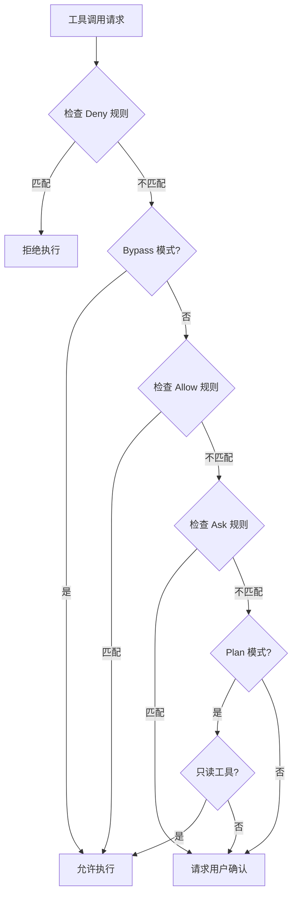
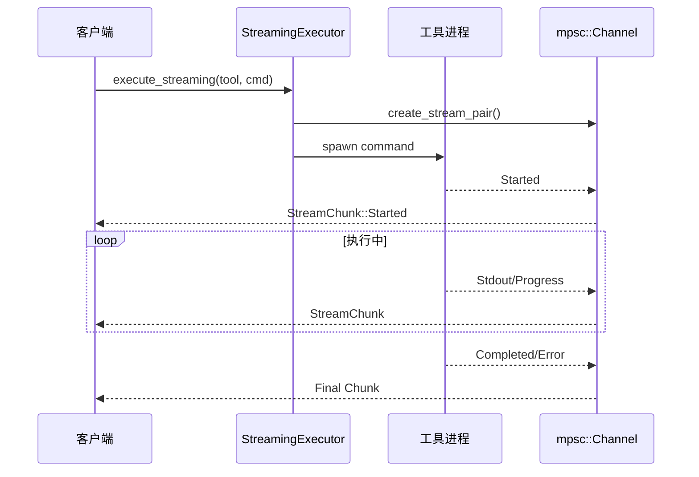

# 生产实践

<!--
  第五章：生产实践部分
  本章覆盖错误处理与恢复、流式输出、权限控制、成本追踪。
  
  Requirements: 5.1-5.5, 1.5, 3.1, 9.3
-->

## 元数据

- **难度**: intermediate
- **预计阅读时间**: 25 分钟
- **前置章节**: [Agent 基础](./../01-fundamentals/), [核心实现](./../02-core-implementation/)
- **相关代码**: baoclaw-core/src/engine/error_handling.rs, baoclaw-core/src/engine/streaming_executor.rs, baoclaw-core/src/permissions/

---

## 问题

<!-- Requirements: 5.1 描述该章节解决的实际工程问题 -->

将 Agent 从原型推向生产环境，我们面临以下核心挑战：

### 1. 错误无处不在，如何优雅恢复？

在生产环境中，错误来源多样：

- **网络错误**: API 调用超时、连接断开
- **服务错误**: LLM API 限流、服务器故障
- **工具错误**: 执行超时、权限不足、参数错误
- **IPC 错误**: 守护进程崩溃、管道断裂

如果每个错误都需要人工干预，系统将无法可靠运行。我们需要：

- 自动识别错误类型
- 选择合适的恢复策略
- 在可恢复时自动重试
- 在不可恢复时优雅降级

### 2. 长时间运行的工具，如何提供实时反馈？

某些工具执行时间较长（如代码搜索、大规模文件操作）：

- 用户不知道工具是否在运行
- 无法看到中间进度
- 可能误以为系统卡死

我们需要流式输出机制：

- 实时推送执行进度
- 支持心跳保活
- 可中断长时间运行的任务

### 3. 工具执行有风险，如何控制权限？

Agent 可以执行任意命令、读写文件，这带来安全风险：

- 误删除重要文件
- 执行危险命令（如 `rm -rf /`）
- 访问敏感数据

我们需要权限控制系统：

- 区分只读和写操作
- 支持细粒度规则配置
- 交互式确认机制

### 问题背景

生产级 Agent 需要三层防护：

```
┌─────────────────────────────────────────────────┐
│                 用户请求                         │
└───────────────────┬─────────────────────────────┘
                    ▼
┌─────────────────────────────────────────────────┐
│           权限控制层 (PermissionGate)            │
│  • 检查工具是否允许执行                           │
│  • 支持规则配置和交互确认                         │
└───────────────────┬─────────────────────────────┘
                    ▼
┌─────────────────────────────────────────────────┐
│           错误处理层 (ErrorHandling)             │
│  • 捕获和分类错误                                 │
│  • 选择恢复策略                                   │
│  • 自动重试或优雅降级                             │
└───────────────────┬─────────────────────────────┘
                    ▼
┌─────────────────────────────────────────────────┐
│           流式输出层 (StreamingExecutor)          │
│  • 实时进度推送                                   │
│  • 心跳保活                                       │
│  • 超时控制                                       │
└───────────────────┬─────────────────────────────┘
                    ▼
                 执行结果
```

---

## 模式

<!-- Requirements: 5.2 讲解通用的设计模式或架构范式 -->

### 模式 1: 错误恢复策略模式

根据错误类型选择不同的恢复策略：

| 错误类型 | 恢复策略 | 原因 |
|---------|---------|------|
| IPC 断开 | 重启进程 | 进程已不可用 |
| 状态同步失败 | 全量同步 | 增量同步已失效 |
| API 限流 | 指数退避重试 | 临时性问题 |
| 认证错误 | 致命错误 | 需要用户干预 |
| 工具超时 | 致命错误 | 需要调整参数 |

### 模式 2: 权限门控模式

权限检查遵循优先级顺序：



### 模式 3: 流式执行模式

长时间运行的工具通过 channel 实时推送进度：



### 权限规则优先级

权限系统使用多源规则，按以下顺序评估：

1. **Deny 规则** - 最高优先级，无条件拒绝
2. **Allow 规则** - 明确允许的工具/模式
3. **Ask 规则** - 需要用户确认
4. **模式默认** - Plan 模式允许只读工具
5. **默认行为** - 询问用户

---

## 实现

<!-- Requirements: 5.3 提供 BaoClaw 的 Rust 代码示例 -->

### 示例 1: 错误恢复策略枚举

`RecoveryStrategy` 定义了不同错误类型对应的恢复策略：

```rust path="baoclaw-core/src/engine/error_handling.rs" lines="36-45"
/// Error recovery strategy for different error types.
#[derive(Clone, Debug)]
pub enum RecoveryStrategy {
    /// Retry with exponential backoff
    Retry {
        max_attempts: u32,
        initial_delay_ms: u64,
    },
    /// Request full state sync from Rust core
    FullStateSync,
    /// Restart the Rust core process
    RestartProcess,
    /// No recovery possible, report to user
    Fatal(String),
}
```

**策略说明：**

| 策略 | 适用场景 | 实现方式 |
|------|---------|---------|
| `Retry` | 临时性错误（限流、网络抖动） | 指数退避重试 |
| `FullStateSync` | 状态不一致 | 重新拉取完整状态 |
| `RestartProcess` | 进程级故障 | 重启守护进程 |
| `Fatal` | 不可恢复错误 | 报告用户，等待干预 |

### 示例 2: 确定恢复策略

`determine_recovery_strategy` 函数根据错误类型返回对应策略：

```rust path="baoclaw-core/src/engine/error_handling.rs" lines="48-72"
/// Determine the recovery strategy for a given error.
pub fn determine_recovery_strategy(error_type: &str, error_message: &str) -> RecoveryStrategy {
    match error_type {
        "ipc_disconnect" | "connection_closed" => RecoveryStrategy::RestartProcess,
        "state_sync_failed" | "patch_apply_failed" => RecoveryStrategy::FullStateSync,
        "api_rate_limited" | "api_server_error" => RecoveryStrategy::Retry {
            max_attempts: 3,
            initial_delay_ms: 1000,
        },
        "api_auth_error" | "api_bad_request" => {
            RecoveryStrategy::Fatal(error_message.to_string())
        }
        "mcp_disconnect" => RecoveryStrategy::Retry {
            max_attempts: 5,
            initial_delay_ms: 2000,
        },
        "tool_timeout" => {
            RecoveryStrategy::Fatal(format!("Tool timed out: {}", error_message))
        }
        _ => RecoveryStrategy::Fatal(error_message.to_string()),
    }
}
```

**关键决策点：**

- **IPC 断开** → 重启进程，因为进程已不可用
- **API 限流** → 重试 3 次，初始延迟 1 秒，指数退避
- **认证错误** → 致命错误，需要用户检查 API Key
- **MCP 断开** → 重试 5 次，给 MCP 服务器更多恢复时间

### 示例 3: 工具超时执行

`execute_tool_with_timeout` 为工具执行添加超时保护：

```rust path="baoclaw-core/src/engine/error_handling.rs" lines="9-20"
/// Execute a tool with a timeout. Returns ToolError::Timeout if exceeded.
pub async fn execute_tool_with_timeout(
    tool: &dyn Tool,
    input: Value,
    context: &ToolContext,
    progress: &dyn ProgressSender,
    timeout_ms: u64,
) -> Result<ToolResult, ToolError> {
    let duration = Duration::from_millis(timeout_ms);
    match timeout(duration, tool.call(input, context, progress)).await {
        Ok(result) => result,
        Err(_) => Err(ToolError::Timeout(timeout_ms)),
    }
}
```

**实现要点：**

- 使用 `tokio::time::timeout` 包装异步调用
- 超时后返回 `ToolError::Timeout` 而非 panic
- 调用方可根据错误类型决定是否重试

### 示例 4: 流式块类型定义

`StreamChunk` 表示流式输出的单个数据块：

```rust path="baoclaw-core/src/engine/streaming_executor.rs" lines="8-26"
/// A chunk of streaming output from a tool execution.
#[derive(Clone, Debug, Serialize, Deserialize)]
pub struct StreamChunk {
    /// Tool execution ID.
    pub execution_id: String,
    /// Tool name.
    pub tool_name: String,
    /// Chunk type.
    pub chunk_type: StreamChunkType,
    /// Text content.
    pub content: String,
    /// Sequence number (0-based).
    pub seq: u32,
    /// Timestamp.
    pub timestamp: String,
}

#[derive(Clone, Debug, PartialEq, Serialize, Deserialize)]
pub enum StreamChunkType {
    Started,    // 工具开始执行
    Progress,   // 中间进度
    Stdout,     // 标准输出
    Stderr,     // 标准错误
    Completed,  // 执行完成
    Error,      // 执行失败
    Heartbeat,  // 心跳保活
}
```

### 示例 5: 流式配置与默认值

`StreamingConfig` 定义流式执行的可配置参数：

```rust path="baoclaw-core/src/engine/streaming_executor.rs" lines="28-55"
/// Configuration for streaming execution.
#[derive(Clone, Debug, Serialize, Deserialize)]
pub struct StreamingConfig {
    /// Maximum chunks to buffer (backpressure).
    pub buffer_size: usize,
    /// Heartbeat interval in milliseconds (0 = disabled).
    pub heartbeat_interval_ms: u64,
    /// Maximum execution time in seconds.
    pub timeout_secs: u64,
    /// Whether to stream stdout.
    pub stream_stdout: bool,
    /// Whether to stream stderr.
    pub stream_stderr: bool,
    /// Maximum output size in bytes (truncates beyond this).
    pub max_output_bytes: usize,
}

impl Default for StreamingConfig {
    fn default() -> Self {
        Self {
            buffer_size: 256,
            heartbeat_interval_ms: 5000,
            timeout_secs: 300,
            stream_stdout: true,
            stream_stderr: true,
            max_output_bytes: 1024 * 1024, // 1MB
        }
    }
}
```

**默认配置说明：**

- `buffer_size: 256` - 最多缓存 256 个块，防止内存爆炸
- `heartbeat_interval_ms: 5000` - 每 5 秒发送心跳
- `timeout_secs: 300` - 5 分钟超时
- `max_output_bytes: 1MB` - 输出超过 1MB 自动截断

### 示例 6: StreamWriter 和 StreamReader

流式执行的写入端和读取端：

```rust path="baoclaw-core/src/engine/streaming_executor.rs" lines="101-163"
/// Write end of a streaming execution — used by tool implementations.
pub struct StreamWriter {
    sender: mpsc::Sender<StreamChunk>,
    execution_id: String,
    seq_counter: u32,
}

impl StreamWriter {
    /// Send a started event.
    pub async fn started(&mut self, tool_name: &str) { /* ... */ }

    /// Send a progress update.
    pub async fn progress(&mut self, message: &str) { /* ... */ }

    /// Send stdout data.
    pub async fn stdout(&mut self, data: &str) { /* ... */ }

    /// Send stderr data.
    pub async fn stderr(&mut self, data: &str) { /* ... */ }

    /// Send completion event.
    pub async fn completed(&mut self) { /* ... */ }

    /// Send error event.
    pub async fn error(&mut self, message: &str) { /* ... */ }

    /// Send heartbeat.
    pub async fn heartbeat(&mut self) { /* ... */ }
}

/// Handle for receiving streaming output from a tool execution.
pub struct StreamReader {
    receiver: mpsc::Receiver<StreamChunk>,
    execution_id: String,
}

impl StreamReader {
    /// Receive the next chunk, waiting if necessary.
    pub async fn next(&mut self) -> Option<StreamChunk> {
        self.receiver.recv().await
    }

    /// Collect all remaining chunks into a single result.
    pub async fn collect(mut self) -> StreamResult { /* ... */ }
}
```

### 示例 7: 创建流式执行对

`create_stream_pair` 创建配对的写入器和读取器：

```rust path="baoclaw-core/src/engine/streaming_executor.rs" lines="91-99"
/// Creates a streaming execution pair (writer, reader).
pub fn create_stream_pair(execution_id: String) -> (StreamWriter, StreamReader) {
    let (tx, rx) = mpsc::channel(256);
    let writer = StreamWriter {
        sender: tx,
        execution_id: execution_id.clone(),
        seq_counter: 0,
    };
    let reader = StreamReader {
        receiver: rx,
        execution_id,
    };
    (writer, reader)
}
```

### 示例 8: PermissionGate 权限门控

`PermissionGate` 管理待处理的权限请求：

```rust path="baoclaw-core/src/permissions/gate.rs" lines="20-56"
/// User's permission decision sent from CLI
#[derive(Clone, Debug, Serialize, Deserialize, PartialEq)]
#[serde(tag = "type")]
pub enum PermissionDecision {
    #[serde(rename = "allow")]
    Allow,
    #[serde(rename = "deny")]
    Deny,
    #[serde(rename = "allow_always")]
    AllowAlways {
        #[serde(skip_serializing_if = "Option::is_none")]
        rule: Option<String>,
    },
}

/// Permission decision channel — maintained in QueryEngine,
/// used by ToolExecutor to wait for user responses.
#[derive(Clone)]
pub struct PermissionGate {
    pending: Arc<RwLock<HashMap<String, oneshot::Sender<PermissionDecision>>>>,
}

impl PermissionGate {
    /// Register a pending permission request, returns a receiver to await the decision.
    pub fn request(&self, tool_use_id: &str) -> oneshot::Receiver<PermissionDecision> {
        let (tx, rx) = oneshot::channel();
        self.pending
            .write()
            .unwrap()
            .insert(tool_use_id.to_string(), tx);
        rx
    }

    /// Submit a user's permission decision. Returns true if the decision was delivered.
    pub fn respond(&self, tool_use_id: &str, decision: PermissionDecision) -> bool {
        if let Some(tx) = self.pending.write().unwrap().remove(tool_use_id) {
            tx.send(decision).is_ok()
        } else {
            false
        }
    }
}
```

**工作流程：**

1. 工具执行前调用 `request(tool_use_id)` 获取 `Receiver`
2. 向客户端发送权限请求事件
3. 用户选择后，客户端调用 `respond(tool_use_id, decision)`
4. 工具执行器通过 `Receiver` 获取决策，继续或拒绝执行

### 示例 9: PermissionManager 权限管理器

`PermissionManager` 实现完整的权限检查逻辑：

```rust path="baoclaw-core/src/permissions/manager.rs" lines="15-35"
#[derive(Clone, Debug, PartialEq, Serialize, Deserialize)]
pub enum PermissionMode {
    Default,            // 默认：询问用户
    Plan,               // 计划模式：只读工具自动允许
    BypassPermissions,  // 绕过模式：所有工具自动允许
    Auto,               // 自动模式
}

#[derive(Clone, Debug, PartialEq)]
pub enum PermissionResult {
    Allow,
    Ask { message: String },
    Deny { message: String },
}

pub struct PermissionManager {
    context: RwLock<ToolPermissionContext>,
}
```

### 示例 10: 权限检查流程

`check_permission` 按优先级顺序评估权限：

```rust path="baoclaw-core/src/permissions/manager.rs" lines="117-165"
impl PermissionManager {
    /// Check permission for a tool invocation.
    ///
    /// Evaluation order:
    /// 1. Deny rules (highest priority)
    /// 2. Allow rules
    /// 3. Ask rules
    /// 4. Mode-specific defaults
    /// 5. Default: Ask
    pub fn check_permission(
        &self,
        tool_name: &str,
        input_description: Option<&str>,
    ) -> PermissionResult {
        let ctx = self.context.read().unwrap();

        // Step 1: Check deny rules first (highest priority)
        if find_matching_rule_in_map(&ctx.always_deny_rules, tool_name, input_description) {
            return PermissionResult::Deny {
                message: format!("Tool '{}' is denied by permission rules", tool_name),
            };
        }

        // Step 2: In BypassPermissions mode, allow all non-denied tools
        if ctx.mode == PermissionMode::BypassPermissions {
            return PermissionResult::Allow;
        }

        // Step 3: Check allow rules
        if find_matching_rule_in_map(&ctx.always_allow_rules, tool_name, input_description) {
            return PermissionResult::Allow;
        }

        // Step 4: Check ask rules
        if find_matching_rule_in_map(&ctx.always_ask_rules, tool_name, input_description) {
            return PermissionResult::Ask {
                message: format!("Tool '{}' requires permission (matched ask rule)", tool_name),
            };
        }

        // Step 5: Plan mode - allow read-only tools, ask for others
        if ctx.mode == PermissionMode::Plan {
            if is_read_only_tool(tool_name) {
                return PermissionResult::Allow;
            }
            return PermissionResult::Ask {
                message: format!("Tool '{}' requires permission in Plan mode", tool_name),
            };
        }

        // Step 6: Default - Ask
        PermissionResult::Ask {
            message: format!("Tool '{}' requires permission", tool_name),
        }
    }
}
```

### 示例 11: Glob 模式匹配

权限规则支持 `*` 通配符：

```rust path="baoclaw-core/src/permissions/manager.rs" lines="43-78"
/// Simple glob matching with `*` wildcard.
/// `*` matches any sequence of characters (including empty).
fn glob_matches(pattern: &str, text: &str) -> bool {
    let pattern_bytes = pattern.as_bytes();
    let text_bytes = text.as_bytes();
    let p_len = pattern_bytes.len();
    let t_len = text_bytes.len();

    // DP approach: dp[i][j] = pattern[0..i] matches text[0..j]
    let mut dp = vec![vec![false; t_len + 1]; p_len + 1];
    dp[0][0] = true;

    // Handle leading *s
    for i in 1..=p_len {
        if pattern_bytes[i - 1] == b'*' {
            dp[i][0] = dp[i - 1][0];
        }
    }

    for i in 1..=p_len {
        for j in 1..=t_len {
            if pattern_bytes[i - 1] == b'*' {
                // * matches zero chars (dp[i-1][j]) or one more char (dp[i][j-1])
                dp[i][j] = dp[i - 1][j] || dp[i][j - 1];
            } else if pattern_bytes[i - 1].to_ascii_lowercase()
                == text_bytes[j - 1].to_ascii_lowercase()
            {
                dp[i][j] = dp[i - 1][j - 1];
            }
        }
    }

    dp[p_len][t_len]
}
```

**匹配示例：**

| 规则模式 | 输入描述 | 匹配结果 |
|---------|---------|---------|
| `git *` | `git push origin main` | ✅ 匹配 |
| `git *` | `git status` | ✅ 匹配 |
| `git *` | `npm install` | ❌ 不匹配 |
| `*` | 任意字符串 | ✅ 匹配 |

### 常见错误示例

#### 错误示例 1：权限检查遗漏

```rust
// ❌ 错误：直接执行工具，跳过权限检查
async fn execute(&self, tool: ToolCall) -> Result<ToolResult> {
    tool.call(input, context, progress).await
}
```

**修正方法：**

```rust
// ✅ 正确：先检查权限
async fn execute(&self, tool: ToolCall) -> Result<ToolResult> {
    let permission = self.permission_manager.check_permission(
        tool.name(),
        Some(&tool.input_description()),
    );
    
    match permission {
        PermissionResult::Deny { message } => {
            return Err(ToolError::PermissionDenied(message));
        }
        PermissionResult::Ask { message } => {
            // 发送权限请求，等待用户响应
            let decision = self.permission_gate.request(&tool.id).await?;
            if matches!(decision, PermissionDecision::Deny) {
                return Err(ToolError::PermissionDenied("User denied".into()));
            }
        }
        PermissionResult::Allow => {}
    }
    
    tool.call(input, context, progress).await
}
```

#### 错误示例 2：流式输出缺少心跳

```rust
// ❌ 错误：长时间运行无心跳，客户端可能超时
async fn long_running_task(&mut self, writer: &mut StreamWriter) {
    for i in 0..1000 {
        // 执行耗时操作
        self.process_item(i).await;
        writer.progress(&format!("处理中: {}/1000", i)).await;
    }
}
```

**修正方法：**

```rust
// ✅ 正确：定期发送心跳
async fn long_running_task(&mut self, writer: &mut StreamWriter) {
    let mut last_heartbeat = Instant::now();
    
    for i in 0..1000 {
        self.process_item(i).await;
        writer.progress(&format!("处理中: {}/1000", i)).await;
        
        // 每 5 秒发送心跳
        if last_heartbeat.elapsed() > Duration::from_secs(5) {
            writer.heartbeat().await;
            last_heartbeat = Instant::now();
        }
    }
}
```

#### 错误示例 3：错误恢复策略选择不当

```rust
// ❌ 错误：认证错误不应该重试
match error_type {
    "api_error" => self.retry_with_backoff().await,
    _ => self.report_fatal(error).await,
}
```

**修正方法：**

```rust
// ✅ 正确：使用 determine_recovery_strategy
let strategy = determine_recovery_strategy(error_type, error_message);

match strategy {
    RecoveryStrategy::Retry { max_attempts, initial_delay_ms } => {
        self.retry_with_backoff(max_attempts, initial_delay_ms).await
    }
    RecoveryStrategy::Fatal(msg) => {
        self.report_fatal(msg).await
    }
    // ... 其他策略
}
```

---

## 思考

<!-- Requirements: 5.4 讨论替代方案与权衡决策 -->

### 替代方案

#### 方案 A: 简单重试（无策略区分）

- **优点**: 实现简单
- **缺点**: 可能对不可恢复错误无限重试，浪费资源
- **适用场景**: 原型开发阶段

#### 方案 B: 分类恢复策略 ✓

- **优点**: 针对不同错误类型选择最优策略，资源高效
- **缺点**: 需要预先定义错误类型和策略映射
- **适用场景**: 生产环境（BaoClaw 选择）

#### 方案 C: 机器学习预测恢复策略

- **优点**: 自适应，可能发现更优策略
- **缺点**: 复杂度高，需要训练数据，不可预测
- **适用场景**: 大规模分布式系统

### 权衡决策

| 决策点 | 选择 | 原因 | 影响 |
|--------|------|------|------|
| 权限存储 | 内存 + 配置文件 | 平衡性能和持久化 | 重启后保留规则 |
| Glob 实现 | 自定义 DP | 无额外依赖，足够简单 | 功能有限但够用 |
| 流式传输 | mpsc channel | Tokio 原生支持，高效 | 需要管理背压 |
| 心跳间隔 | 5 秒 | 平衡响应和开销 | 及时检测僵尸进程 |
| 超时默认值 | 5 分钟 | 覆盖大部分工具 | 长任务需自定义 |

### 设计决策：为什么用 Channel 做流式传输？

```rust
let (tx, rx) = mpsc::channel(256);
```

**优点：**

- **解耦**: 工具执行和结果消费分离
- **背压**: buffer 满时发送方自动等待
- **取消安全**: 接收方丢弃时发送方会感知
- **多消费者**: 可通过 broadcast 扩展

**缺点：**

- 需要管理 channel 生命周期
- 异步上下文才能使用

**结论:** 对于 Agent 场景，工具执行和客户端响应天然分离，channel 是最佳选择。

### 设计决策：权限规则的优先级

为什么 Deny > Allow > Ask？

1. **Deny 最高**: 安全第一，明确拒绝的规则必须生效
2. **Allow 其次**: 明确允许的工具应该快速通过
3. **Ask 最后**: 不确定时询问用户，提供交互机会

这种顺序确保：

- 管理员可以通过 Deny 规则强制禁止危险操作
- 用户可以通过 Allow 规则加速常用操作
- 新工具默认询问，避免意外执行

---

## 总结

<!-- Requirements: 5.5 提供要点总结与延伸阅读链接 -->

### 核心要点

- **错误恢复策略**: 根据错误类型选择重试、同步、重启或致命处理
- **流式输出**: 通过 mpsc channel 实时推送进度，支持心跳和超时
- **权限门控**: Deny > Allow > Ask 的优先级顺序，支持 Glob 模式匹配
- **多层防护**: 权限层 → 错误处理层 → 流式层的架构设计

### 关键概念回顾

1. **RecoveryStrategy**: 错误恢复策略枚举，区分可恢复和不可恢复错误
2. **StreamChunk**: 流式输出数据块，包含类型、内容、序列号
3. **PermissionGate**: 权限门控，管理待处理的权限请求
4. **PermissionManager**: 权限管理器，实现规则评估和匹配

### 代码引用

| 概念 | 源文件 |
|------|--------|
| 错误恢复策略 | [error_handling.rs](./../../../baoclaw-core/src/engine/error_handling.rs) |
| 流式执行器 | [streaming_executor.rs](./../../../baoclaw-core/src/engine/streaming_executor.rs) |
| 权限门控 | [permissions/gate.rs](./../../../baoclaw-core/src/permissions/gate.rs) |
| 权限管理器 | [permissions/manager.rs](./../../../baoclaw-core/src/permissions/manager.rs) |

### 延伸阅读

#### 相关章节

- [上一章：IPC 与多客户端](./../04-ipc-multiclient/) - 了解守护进程和 IPC 架构
- [下一章：高级模式](./../06-advanced-patterns/) - 探索沙箱执行和自我进化

#### 外部资源

- [Tokio Channel 文档](https://docs.rs/tokio/latest/tokio/sync/mpsc/index.html) - mpsc channel 详细说明
- [Rust 错误处理最佳实践](https://doc.rust-lang.org/book/ch09-00-error-handling.html) - 错误处理指南
- [Glob 模式匹配](https://en.wikipedia.org/wiki/Glob_(programming)) - Glob 语法参考
