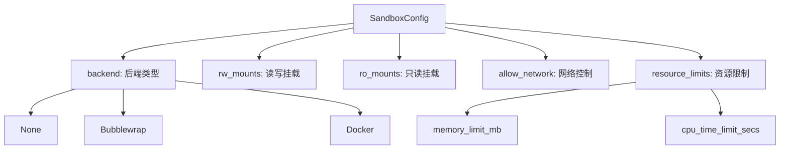
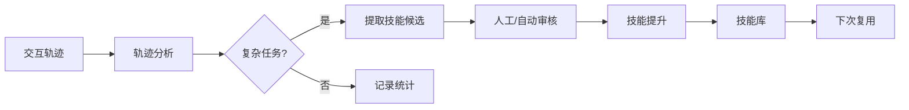
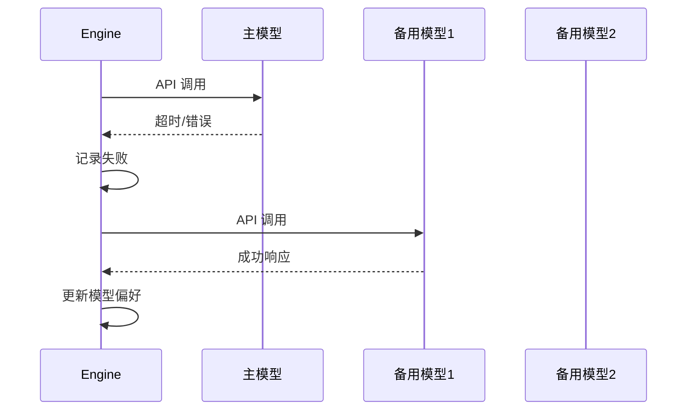

# 高级模式

<!--
  第六章：高级模式
  本章介绍 Agent 的高级特性和前沿模式。
  
  Requirements: 5.1-5.5, 1.6, 3.1, 9.3
-->

## 元数据

- **难度**: advanced
- **预计阅读时间**: 25 分钟
- **前置章节**: [基础部分](./../01-fundamentals/), [核心实现](./../02-core-implementation/)
- **相关代码**: baoclaw-core/src/engine/sandbox.rs, baoclaw-core/src/engine/evolution.rs

---

## 问题

<!-- Requirements: 5.1 描述该章节解决的实际工程问题 -->

当 Agent 进入生产环境后，我们面临以下高级挑战：

### 1. 工具执行的安全风险

Agent 执行的命令可能来自不可信来源（如用户输入、外部 API 响应）。直接在宿主机执行存在以下风险：

- **文件系统破坏**：误删重要文件、写入敏感位置
- **权限泄露**：访问不应该访问的私有数据
- **网络攻击**：发起恶意请求、数据外泄
- **资源耗尽**：无限循环、内存泄漏、CPU 占满

```
传统执行：Agent → Shell → 宿主机内核 → 危险！
安全执行：Agent → Sandbox → 隔离环境 → 受控
```

### 2. 缺乏自我改进能力

传统 Agent 每次交互都是独立的，无法从过去的经验中学习：

- 重复解决相同类型的问题
- 无法识别可复用的操作模式
- 没有持续的技能积累机制
- 难以适应用户偏好和工作流

### 3. 多模型协调的复杂性

单一模型可能无法满足所有场景需求：

- 不同任务需要不同能力（速度 vs 质量）
- 成本控制需要模型降级策略
- 特定领域需要专门模型
- 模型故障需要自动切换

### 问题背景

高级模式通过**沙箱执行**解决安全问题，通过**自我进化引擎**实现持续改进，通过**模型降级策略**保证可靠性。

---

## 模式

<!-- Requirements: 5.2 讲解通用的设计模式或架构范式 -->

### 模式 1: 沙箱执行（Sandbox Execution）

沙箱执行模式将工具运行在隔离环境中，限制其对宿主系统的访问。

#### 三层隔离架构

| 层级 | 后端 | 隔离强度 | 适用场景 |
|------|------|----------|----------|
| 无沙箱 | None | 无 | 可信环境、本地开发 |
| 轻量沙箱 | Bubblewrap | 进程级 | Linux 生产环境 |
| 容器沙箱 | Docker | 系统级 | 高安全要求、多租户 |

#### 沙箱配置要素



#### 工作原理

```
┌─────────────────────────────────────────────┐
│                 Host System                  │
│  ┌───────────────────────────────────────┐  │
│  │            Sandbox Container           │  │
│  │  ┌─────────────────────────────────┐  │  │
│  │  │        Tool Execution           │  │  │
│  │  │                                 │  │  │
│  │  │  • 只读: /usr, /lib, /bin       │  │  │
│  │  │  • 读写: /workspace (项目目录)   │  │  │
│  │  │  • 隔离: 网络、进程、用户空间     │  │  │
│  │  └─────────────────────────────────┘  │  │
│  └───────────────────────────────────────┘  │
└─────────────────────────────────────────────┘
```

### 模式 2: 自我进化引擎（Evolution Engine）

自我进化引擎从交互中学习，自动创建和改进技能。

#### 学习循环



#### 核心数据结构

| 结构 | 作用 | 存储位置 |
|------|------|----------|
| Trajectory | 记录完整交互轨迹 | trajectories.jsonl |
| SessionSummary | 会话级统计摘要 | session_summaries.jsonl |
| SkillCandidate | 待审核的技能候选 | candidates/*.json |
| SkillStats | 技能使用统计 | skill_stats.json |

#### 自改进周期（5 阶段）

1. **收集 (Collect)**: 记录每次交互的轨迹数据
2. **评估 (Evaluate)**: 分析技能使用效果和用户反馈
3. **改进 (Improve)**: 生成改进建议
4. **验证 (Validate)**: 检查技能完整性
5. **淘汰 (Retire)**: 自动禁用效果差的技能

### 模式 3: 模型降级策略

当主模型不可用时，自动切换到备用模型。



---

## 实现

<!-- Requirements: 5.3 提供 BaoClaw 的 Rust 代码示例 -->

### 示例 1: SandboxBackend 枚举定义

SandboxBackend 定义了三种沙箱后端：

```rust path="baoclaw-core/src/engine/sandbox.rs" lines="8-14"
/// Sandbox backend type.
#[derive(Clone, Debug, PartialEq, Serialize, Deserialize)]
pub enum SandboxBackend {
    /// No sandbox — direct execution (for trusted environments).
    None,
    /// Bubblewrap (bwrap) — lightweight Linux namespace sandbox.
    Bubblewrap,
    /// Docker container isolation.
    Docker { image: String },
}
```

**设计说明：**

- `None`: 直接执行，适用于可信环境
- `Bubblewrap`: Linux namespace 隔离，轻量高效
- `Docker`: 完整容器隔离，安全性最高

### 示例 2: SandboxConfig 配置结构

SandboxConfig 封装了沙箱执行的所有配置选项：

```rust path="baoclaw-core/src/engine/sandbox.rs" lines="16-35"
/// Configuration for sandbox execution.
#[derive(Clone, Debug, Serialize, Deserialize)]
pub struct SandboxConfig {
    /// Which backend to use.
    pub backend: SandboxBackend,
    /// Directories to mount read-write into the sandbox.
    pub rw_mounts: Vec<String>,
    /// Directories to mount read-only into the sandbox.
    pub ro_mounts: Vec<String>,
    /// Environment variables to pass through.
    pub env_passthrough: Vec<String>,
    /// Network access allowed.
    pub allow_network: bool,
    /// Memory limit in MB (0 = unlimited).
    pub memory_limit_mb: u32,
    /// CPU time limit in seconds (0 = unlimited).
    pub cpu_time_limit_secs: u32,
    /// Working directory inside sandbox.
    pub workdir: Option<String>,
}
```

**配置解析：**

| 字段 | 类型 | 默认值 | 说明 |
|------|------|--------|------|
| `backend` | enum | None | 沙箱后端类型 |
| `rw_mounts` | Vec\<String\> | [] | 读写挂载目录 |
| `ro_mounts` | Vec\<String\> | [] | 只读挂载目录 |
| `allow_network` | bool | true | 是否允许网络 |
| `memory_limit_mb` | u32 | 0 | 内存限制 (MB) |
| `cpu_time_limit_secs` | u32 | 300 | CPU 时间限制 (秒) |

### 示例 3: 自动检测最佳后端

`auto_detect()` 方法自动选择可用的沙箱后端：

```rust path="baoclaw-core/src/engine/sandbox.rs" lines="55-71"
impl SandboxConfig {
    /// Create config that auto-detects the best available backend.
    pub fn auto_detect() -> Self {
        let backend = if which_exists("bwrap") {
            SandboxBackend::Bubblewrap
        } else if which_exists("docker") {
            SandboxBackend::Docker {
                image: std::env::var("BAOCLAW_SANDBOX_IMAGE")
                    .unwrap_or_else(|_| "baoclaw-sandbox:latest".into()),
            }
        } else {
            SandboxBackend::None
        };
        Self {
            backend,
            ..Self::default()
        }
    }
}
```

**检测优先级：**

1. 优先使用 `bwrap`（Bubblewrap）— 轻量级，性能好
2. 其次使用 `docker` — 更安全，需要预构建镜像
3. 最后回退到 `None` — 无沙箱，仅限可信环境

### 示例 4: 构建 Bubblewrap 命令

Bubblewrap 使用 Linux namespace 实现轻量级隔离：

```rust path="baoclaw-core/src/engine/sandbox.rs" lines="95-145"
fn build_bwrap_args(&self, command: &str, cwd: &Path) -> Vec<String> {
    let mut args = vec!["bwrap".to_string()];

    // Bind host filesystem read-only by default
    args.push("--ro-bind".into());
    args.push("/usr".into());
    args.push("/usr".into());

    args.push("--ro-bind".into());
    args.push("/lib".into());
    args.push("/lib".into());

    args.push("--ro-bind".into());
    args.push("/lib64".into());
    args.push("/lib64".into());

    args.push("--ro-bind".into());
    args.push("/bin".into());
    args.push("/bin".into());

    args.push("--proc".into());
    args.push("/proc".into());

    args.push("--dev".into());
    args.push("/dev".into());

    args.push("--tmpfs".into());
    args.push("/tmp".into());

    // RW mounts
    for mount in &self.rw_mounts {
        if Path::new(mount).exists() {
            args.push("--bind".into());
            args.push(mount.clone());
            args.push(mount.clone());
        }
    }
    // ... 网络隔离、工作目录等
}
```

**Bubblewrap 隔离机制：**

- `--ro-bind`: 只读绑定挂载，保护系统目录
- `--bind`: 读写绑定，用于项目目录
- `--proc/--dev`: 创建虚拟文件系统
- `--tmpfs`: 临时文件系统，每次运行重置
- `--unshare-net`: 禁用网络（可选）

### 示例 5: 构建 Docker 命令

Docker 提供完整的容器级隔离：

```rust path="baoclaw-core/src/engine/sandbox.rs" lines="162-220"
fn build_docker_args(&self, command: &str, cwd: &Path, image: &str) -> Vec<String> {
    let mut args = vec!["docker".to_string(), "run".to_string()];

    // Remove container after exit
    args.push("--rm".into());

    // Run as current user to avoid permission issues with mounted volumes
    #[cfg(unix)]
    {
        let uid = unsafe { libc::getuid() };
        let gid = unsafe { libc::getgid() };
        args.push("--user".into());
        args.push(format!("{}:{}", uid, gid));
    }

    // Memory limit
    if self.memory_limit_mb > 0 {
        args.push(format!("--memory={}m", self.memory_limit_mb));
    }

    // Network
    if !self.allow_network {
        args.push("--network=none".into());
    }

    // Mount CWD
    if let Some(cwd_str) = cwd.to_str() {
        args.push("-v".into());
        args.push(format!("{}:{}", cwd_str, cwd_str));
    }
    // ... 环境变量、工作目录等
}
```

**Docker 安全特性：**

- `--rm`: 容器退出后自动删除
- `--user`: 以宿主机用户身份运行，避免权限问题
- `--memory`: 内存限制，防止资源耗尽
- `--network=none`: 完全禁用网络

### 示例 6: 沙箱配置验证

`validate()` 方法检查沙箱配置是否有效：

```rust path="baoclaw-core/src/engine/sandbox.rs" lines="260-283"
/// Validate the sandbox configuration and return a human-readable error if invalid.
/// Returns None if everything is OK.
pub fn validate(&self) -> Option<String> {
    match &self.backend {
        SandboxBackend::None => None,
        SandboxBackend::Bubblewrap => {
            if !which_exists("bwrap") {
                Some("bwrap not found. Install bubblewrap: apt install bubblewrap".into())
            } else {
                None
            }
        }
        SandboxBackend::Docker { image } => {
            if !which_exists("docker") {
                return Some("docker not found in PATH".into());
            }
            if !docker_image_exists(image) {
                Some(format!(
                    "Docker image '{}' not found. Build it with: docker build -t {} -f Dockerfile.sandbox .",
                    image, image
                ))
            } else {
                None
            }
        }
    }
}
```

### 示例 7: EvolutionEngine 核心结构

EvolutionEngine 从交互中学习，创建和改进技能：

```rust path="baoclaw-core/src/engine/evolution.rs" lines="15-40"
/// Structured summary of a completed session, extracted on session close.
#[derive(Clone, Debug, Serialize, Deserialize)]
pub struct SessionSummary {
    pub session_id: String,
    pub timestamp: String,
    pub cwd: String,
    pub model: String,
    pub duration_secs: u64,
    /// Number of user→assistant turns
    pub turn_count: usize,
    /// All user messages (truncated to 200 chars each)
    pub user_topics: Vec<String>,
    /// Tool usage frequency: (tool_name, count)
    pub tool_usage: Vec<(String, u32)>,
    /// Tools that returned errors: (tool_name, error_preview)
    pub errors: Vec<(String, String)>,
    /// Total token usage
    pub total_input_tokens: u64,
    pub total_output_tokens: u64,
    pub total_cache_read: u64,
    pub total_cost_usd: f64,
    /// Skills that were loaded/used during this session
    pub skills_used: Vec<String>,
}
```

### 示例 8: 轨迹记录数据结构

Trajectory 记录完整的交互轨迹，用于技能提取和 RLHF 训练：

```rust path="baoclaw-core/src/engine/evolution.rs" lines="53-90"
/// A recorded interaction trajectory for RLHF training data.
#[derive(Clone, Debug, Serialize, Deserialize)]
pub struct Trajectory {
    pub id: String,
    pub timestamp: String,
    pub cwd: String,
    pub user_prompt: String,
    pub assistant_actions: Vec<TrajectoryAction>,
    pub outcome: TrajectoryOutcome,
    pub tool_count: usize,
    pub duration_ms: u64,
    /// User signal: was this interaction successful? None = not rated.
    pub user_rating: Option<TrajectoryRating>,
}

#[derive(Clone, Debug, Serialize, Deserialize)]
pub struct TrajectoryAction {
    pub tool_name: String,
    pub input_summary: String,
    pub output_summary: String,
    pub is_error: bool,
}

#[derive(Clone, Debug, Serialize, Deserialize)]
pub enum TrajectoryOutcome {
    /// Task completed normally (end_turn)
    Completed { final_text_preview: String },
    /// Task hit max turns
    MaxTurns,
    /// Task was aborted by user
    Aborted,
    /// Task errored
    Error { code: String, message: String },
}
```

### 示例 9: 技能自动提取

当任务复杂度超过阈值时，自动提取技能候选：

```rust path="baoclaw-core/src/engine/evolution.rs" lines="200-240"
/// Record a completed interaction as a trajectory.
pub async fn record_trajectory(&self, trajectory: Trajectory) {
    let dir = self.base_dir.lock().await;
    // ... 持久化轨迹

    // Increment task count
    let mut count = self.task_count.lock().await;
    *count += 1;

    // Check if we should trigger skill creation
    if trajectory.tool_count >= SKILL_CREATION_THRESHOLD {
        if let TrajectoryOutcome::Completed { .. } = &trajectory.outcome {
            let candidate = self.extract_skill_candidate(&trajectory);
            self.save_skill_candidate(&*dir, &candidate).await;
            eprintln!("Evolution: skill candidate '{}' extracted from trajectory {}",
                candidate.name, trajectory.id);
        }
    }

    // Check if we should trigger self-evaluation
    if *count % SELF_EVAL_INTERVAL == 0 && *count > 0 {
        eprintln!("Evolution: self-evaluation triggered at task count {}", *count);
        // Write nudge file for system prompt builder
    }
}
```

**技能提取条件：**

- `SKILL_CREATION_THRESHOLD = 3`: 工具调用数 >= 3 视为复杂任务
- 仅对成功完成的任务（`Completed`）提取
- 自动生成描述和触发模式

### 示例 10: 技能候选提取逻辑

从成功轨迹中提取可复用的操作模式：

```rust path="baoclaw-core/src/engine/evolution.rs" lines="250-275"
/// Extract a skill candidate from a successful trajectory.
fn extract_skill_candidate(&self, trajectory: &Trajectory) -> SkillCandidate {
    // Build a procedure description from the tool actions
    let steps: Vec<String> = trajectory.assistant_actions.iter()
        .filter(|a| !a.is_error)
        .enumerate()
        .map(|(i, a)| format!("{}. Use `{}`: {}", i + 1, a.tool_name, a.input_summary))
        .collect();

    let procedure = steps.join("\n");

    // Derive a name from the user prompt (first 50 chars, slugified)
    let name_raw = trajectory.user_prompt.chars().take(50).collect::<String>();
    let name = slugify(&name_raw);

    SkillCandidate {
        name,
        description: format!("Auto-generated from: {}", 
            trajectory.user_prompt.chars().take(100).collect::<String>()),
        trigger_pattern: trajectory.user_prompt.chars().take(200).collect(),
        procedure,
        source_trajectory_id: trajectory.id.clone(),
        created_at: chrono::Utc::now().to_rfc3339(),
    }
}
```

### 示例 11: 技能提升

将审核通过的技能候选转化为正式技能：

```rust path="baoclaw-core/src/engine/evolution.rs" lines="285-305"
/// Promote a skill candidate to an actual skill file.
/// Skills go to ~/.baoclaw/skills/ (personal, cross-project) by default.
pub async fn promote_skill(&self, _cwd: &Path, candidate_name: &str, 
                            skill_content: &str) -> Result<String, String> {
    let home = std::env::var("HOME").unwrap_or_else(|_| "/tmp".to_string());
    let skills_dir = PathBuf::from(home).join(".baoclaw").join("skills");
    let _ = std::fs::create_dir_all(&skills_dir);

    let skill_path = skills_dir.join(format!("{}.md", candidate_name));
    std::fs::write(&skill_path, skill_content)
        .map_err(|e| format!("Failed to write skill: {}", e))?;

    // Remove the candidate file
    let dir = self.base_dir.lock().await;
    let candidate_path = dir.join("candidates").join(format!("{}.json", candidate_name));
    let _ = std::fs::remove_file(&candidate_path);

    eprintln!("Evolution: promoted skill '{}' to {}", candidate_name, skill_path.display());
    Ok(skill_path.to_string_lossy().to_string())
}
```

### 示例 12: 会话关闭钩子

会话结束时自动生成摘要，为下次会话提供上下文：

```rust path="baoclaw-core/src/engine/evolution.rs" lines="390-470"
/// Called when the last client disconnects from a shared session.
/// Extracts a structured summary from the session transcript.
pub async fn on_session_close(
    &self,
    session_id: &str,
    cwd: &str,
    model: &str,
    messages: &[crate::models::message::Message],
    total_usage: &crate::models::message::Usage,
    total_cost_usd: f64,
    session_duration_secs: u64,
) {
    // Extract user topics, tool usage, errors, skills used
    let mut user_topics: Vec<String> = Vec::new();
    let mut tool_counts: HashMap<String, u32> = HashMap::new();
    let mut errors: Vec<(String, String)> = Vec::new();
    let mut skills_used: Vec<String> = Vec::new();

    for msg in messages {
        // Parse messages to extract structured data
        match &msg.content {
            MessageContent::User { message, .. } => {
                // Extract user text topics
                let text = extract_text_from_value(&message.content);
                if !text.is_empty() {
                    user_topics.push(text.chars().take(200).collect());
                }
            }
            MessageContent::Assistant { message, .. } => {
                for block in &message.content {
                    if let ContentBlock::ToolUse { name, input, .. } = block {
                        *tool_counts.entry(name.clone()).or_insert(0) += 1;
                    }
                }
            }
            _ => {}
        }
    }

    // Build and persist SessionSummary
    // Generate pending_review.json for next session
}
```

### 示例 13: 自改进系统提示

EvolutionEngine 为下次会话生成反思提示：

```rust path="baoclaw-core/src/engine/evolution.rs" lines="340-385"
/// Build a system prompt fragment for the evolution system.
pub async fn build_prompt_fragment(&self, _cwd: &Path) -> Option<String> {
    let mut parts = Vec::new();

    // Check for pending session review (from previous session's close hook)
    if review exists {
        parts.push(format!(
            "# 🔁 Last Session Review (Auto-Generated)\n\
            The previous session `{}` had {} turns. Here's what happened:\n\
            \n\
            ## User Topics:\n{}\n\
            \n\
            ## Tools Used:\n{}\n\
            \n\
            **Self-improvement nudge**: Reflect on the above. Ask yourself:\n\
            - Were there repetitive patterns that should become a skill?\n\
            - Did any errors reveal a gap in your knowledge or approach?\n\
            - Should any preferences or decisions be saved to long-term memory?\n",
            session_id, turn_count, topics_str, tools_str,
        ));
    }

    // List pending skill candidates
    let candidates = self.list_candidates().await;
    if !candidates.is_empty() {
        parts.push("# Pending Skill Candidates\n\nThe following skill candidates were auto-extracted. Consider promoting the useful ones:\n".to_string());
    }

    if parts.is_empty() { None } else { Some(parts.join("\n")) }
}
```

### 示例 14: 技能评估与分级

Phase 2 新增的技能自改进功能：

```rust path="baoclaw-core/src/engine/evolution.rs" lines="127-160"
/// Grade assigned to a skill during evaluation.
#[derive(Clone, Debug, PartialEq, Serialize, Deserialize)]
pub enum SkillGrade {
    Excellent,
    Good,
    NeedsImprovement,
    Poor,
    Critical,
    InsufficientData,
}

/// Suggested action based on skill evaluation.
#[derive(Clone, Debug, PartialEq, Serialize, Deserialize)]
pub enum SuggestedAction {
    None,
    MinorTweak,
    Improve,
    MajorRevision,
    Retire,
}

/// Result of evaluating a skill's effectiveness.
#[derive(Clone, Debug, Serialize, Deserialize)]
pub struct SkillEvaluation {
    pub skill_name: String,
    pub score: f64,
    pub grade: SkillGrade,
    pub diagnostics: Vec<String>,
    pub suggested_action: SuggestedAction,
}
```

### 常见错误示例

#### 错误示例 1：沙箱配置过于宽松

```rust
// ❌ 错误：允许网络访问且挂载敏感目录
let config = SandboxConfig {
    backend: SandboxBackend::Bubblewrap,
    rw_mounts: vec!["/".to_string()], // 挂载整个根目录
    allow_network: true,
    ..SandboxConfig::default()
};
```

**修正方法：**

```rust
// ✅ 正确：只挂载必要目录，禁用网络
let config = SandboxConfig {
    backend: SandboxBackend::Bubblewrap,
    rw_mounts: vec!["/home/user/project".to_string()],
    allow_network: false, // 禁用网络
    ..SandboxConfig::default()
};
```

#### 错误示例 2：未验证沙箱可用性

```rust
// ❌ 错误：假设沙箱一定可用
let config = SandboxConfig::auto_detect();
let args = config.build_command_args("rm -rf /", cwd);
```

**修正方法：**

```rust
// ✅ 正确：验证沙箱配置
let config = SandboxConfig::auto_detect();
if let Some(err) = config.validate() {
    eprintln!("Sandbox validation failed: {}", err);
    // 降级或终止
}
let args = config.build_command_args(cmd, cwd);
```

---

## 思考

<!-- Requirements: 5.4 讨论替代方案与权衡决策 -->

### 替代方案

#### 沙箱执行方案对比

| 方案 | 优点 | 缺点 | 适用场景 |
|------|------|------|----------|
| 无沙箱 | 性能最优 | 安全风险高 | 本地开发、可信环境 |
| Bubblewrap | 轻量、启动快 | 仅限 Linux | 生产环境首选 |
| Docker | 安全性高、跨平台 | 启动慢、资源占用 | 高安全要求 |
| gVisor | 内核级隔离 | 复杂度高 | 金融、医疗等敏感场景 |
| Firecracker | 微 VM、极快 | 需要 KVM | Serverless、多租户 |

#### 自我进化方案对比

| 方案 | 实现方式 | 优点 | 缺点 |
|------|----------|------|------|
| 轨迹学习 ✓ | 记录交互提取技能 | 自动化、无额外成本 | 需要人工审核 |
| RLHF 微调 | 收集偏好数据训练 | 效果持久 | 需要大量数据、计算资源 |
| 检索增强 | 向量数据库存储经验 | 实时性强 | 需要额外检索开销 |
| 规则引擎 | 预定义规则 | 可控性强 | 缺乏灵活性 |

### 权衡决策

#### 沙箱安全 vs 开发效率

```
安全性: None < Bubblewrap < Docker < gVisor
效率:   None > Bubblewrap > Docker > gVisor
```

**决策建议：**

- **开发环境**: `None` 或 `Bubblewrap`（快速迭代）
- **生产环境**: `Bubblewrap` 或 `Docker`（安全优先）
- **高安全场景**: `Docker` + 只读文件系统 + 禁用网络

#### 自动进化 vs 人工控制

**自动化的风险：**

- 可能学习到错误的模式
- 技能质量难以保证
- 需要审核机制

**BaoClaw 的平衡：**

- 自动提取技能候选 → 存入 `candidates/` 目录
- 人工审核或 LLM 评估 → 决定是否提升
- 定期自评估 → 淘汰效果差的技能

### 设计决策：为什么选择 Bubblewrap 作为默认沙箱？

**优点：**

1. **轻量级**: 基于 Linux namespace，无容器开销
2. **启动快**: 毫秒级启动，适合高频工具调用
3. **非特权**: 普通用户即可运行，无需 root
4. **广泛可用**: 大多数 Linux 发行版支持

**缺点：**

1. 仅限 Linux（macOS/Windows 需要 Docker）
2. 需要安装 `bwrap` 命令

**结论:** 对于 BaoClaw 的主要部署环境（Linux 服务器），Bubblewrap 提供了最佳的安全/性能平衡。

---

## 总结

<!-- Requirements: 5.5 提供要点总结与延伸阅读链接 -->

### 核心要点

- **沙箱执行**：通过隔离环境限制工具执行的风险，支持 Bubblewrap 和 Docker 两种后端
- **自我进化引擎**：从交互轨迹中自动提取技能，实现持续改进
- **技能生命周期**：候选提取 → 审核 → 提升 → 评估 → 淘汰
- **会话钩子**：会话关闭时生成摘要，为下次提供反思上下文

### 关键概念回顾

1. **SandboxBackend**: 三种沙箱后端（None/Bubblewrap/Docker），根据环境自动选择
2. **SandboxConfig**: 沙箱配置，控制挂载、网络、资源限制
3. **Trajectory**: 完整的交互轨迹记录，用于技能提取和 RLHF 训练
4. **SessionSummary**: 会话级别的统计摘要，包含主题、工具使用、错误信息
5. **SkillCandidate**: 从成功交互中自动提取的技能候选

### 延伸阅读

#### 官方资源

- [Sandbox 源码](./../../../baoclaw-core/src/engine/sandbox.rs) - 沙箱执行完整实现
- [Evolution 源码](./../../../baoclaw-core/src/engine/evolution.rs) - 自我进化引擎实现
- [BaoClaw GitHub](https://github.com/baoclaw/baoclaw) - 完整项目源码

#### 相关章节

- [权限控制](./../05-production/) - 工具权限检查与用户确认
- [错误处理与恢复](./../05-production/) - 模型降级与故障恢复

#### 外部资源

- [Bubblewrap 文档](https://github.com/containers/bubblewrap) - Linux namespace 沙箱
- [Docker 安全最佳实践](https://docs.docker.com/engine/security/) - 容器安全指南
- [RLHF 论文](https://arxiv.org/abs/2203.02155) - 人类反馈强化学习
